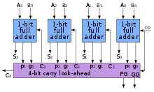

# How Computers Calculate

## ALU 算术逻辑单元 Arithmetic logic unit

1. *Arithmetic Unit* 算术单元
2. *Logic Unit* 逻辑单元

### 半加器 Half Adder

*A,B as input,C as Carry(进位),S as Output*

### Full Adder

*Cin as the previous less-significant stage*

## Carry-look-ahead Adder

## Overflow

*arithmetic overflow*

