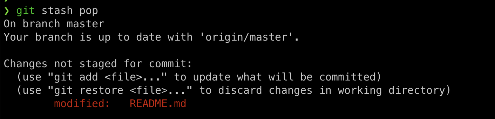

1. If you don’t have any past experience with Git, either try reading the first couple chapters of [Pro Git](https://git-scm.com/book/en/v2) or go through a tutorial like [Learn Git Branching](https://learngitbranching.js.org/). As you’re working through it, relate Git commands to the data model.
   如果你没有使用Git的经验，可以尝试阅读《Pro Git》的前几章，或者参考《Learn Git Branching》这样的教程。在学习过程中，将Git命令与数据模型联系起来。

   1. Clone the repository for the class website
      克隆课程网站的代码库。

      1. Explore the version history by visualizing it as a graph.
         将版本历史可视化为图形，以便探索。

      

      1. Who was the last person to modify `README.md`? (Hint: use `git log` with an argument).
         谁是最后修改 `README.md` 的人？（提示：使用带有参数的 `git log`）。
      
      
      
      1. What was the commit message associated with the last modification to the`collections:` line of `_config.yml`? (Hint: use `git blame` and `git show`).
         最后一次对 `_config.yml` 行进行修改的提交信息是什么？（提示：使用 `git blame` 和 `git show` ）。
         
         

* 学习Git时常见的一个错误是提交不应由Git管理的大文件或添加敏感信息。尝试将文件添加到存储库中，进行一些提交，然后从历史记录中删除该文件（您可能需要查看这个）。

[从存储库删除敏感数据](https://docs.github.com/zh/authentication/keeping-your-account-and-data-secure/removing-sensitive-data-from-a-repository)

`git filter-repo` 工具和 BFG Repo-Cleaner 将重写存储库的历史记录，这将更改你更改的现有提交的 SHA，以及任何相关的提交。 更改的提交 SHA 可能会影响存储库中未完结的拉取请求。 我们建议在从存储库中删除文件之前合并或关闭所有未完结的拉取请求。

可以使用 `git rm` 从最新提交中删除文件。 有关删除与最新提交一起添加的文件的信息，请参阅“[关于 GitHub 上的大文件](https://docs.github.com/zh/repositories/working-with-files/managing-large-files/about-large-files-on-github#removing-files-from-a-repositorys-history)”。

* 从GitHub克隆一些存储库，并修改其中一个现有文件。当你执行 `git stash` 时会发生什么？运行 `git log --all --oneline` 时你会看到什么？使用 `git stash` 撤消你所做的操作，请运行 `git stash pop` 。在什么情况下这可能会有用？

像许多命令行工具一样，Git提供了一个配置文件（或点文件）叫做 `~/.gitconfig` 。在 `~/.gitconfig` 中创建一个别名，这样当你运行 `git graph` 时，你会得到 `git log --all --graph --decorate --oneline`的输出。你可以通过直接编辑 `~/.gitconfig` 文件来实现这一点，或者你可以使用 `git config` 命令来添加别名。关于git别名的信息可以在这里找到。

在运行 `git config --global core.excludesfile ~/.gitignore_global` 之后，您可以在 `~/.gitignore_global` 中定义全局忽略模式。这样做，并设置您的全局gitignore文件来忽略特定于操作系统或编辑器的临时文件，如 `.DS_Store` 。

* Fork the [repository for the class website](https://github.com/missing-semester/missing-semester), find a typo or some other improvement you can make, and submit a pull request on GitHub (you may want to look at [this](https://github.com/firstcontributions/first-contributions)). Please only submit PRs that are useful (don’t spam us, please!). If you can’t find an improvement to make, you can skip this exercise.