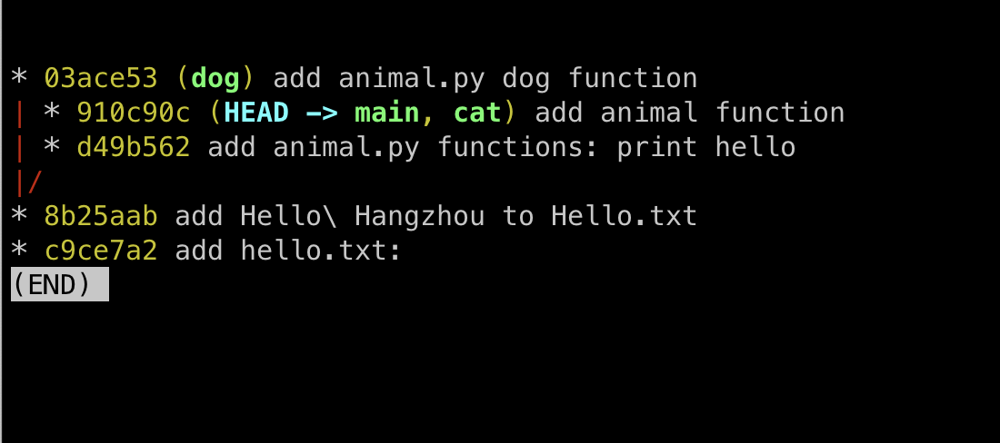
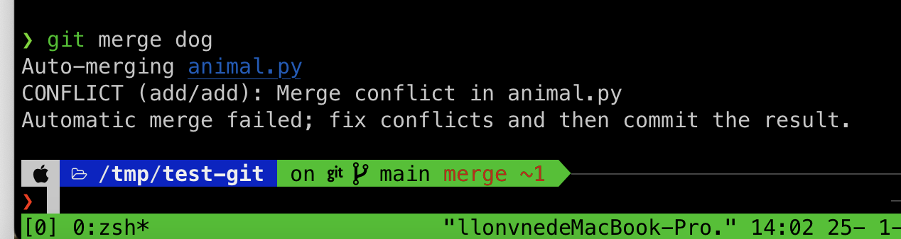

# Version Control (Git)

*tools to keep track of changes to source code or other collections of files or folders*

## file-folder model
* folder is tree
* file is blob

*git use DAG(directed acyclic graph) to model history*


## Internal
```
type blob = array<byte>
type tree = map<String,tree|blob>
type commit = struct
{
	parent:array<commit>
	author:String
	message:String
	snapshot:tree
}

# 这些都是 References(Key) 真正的存储都在 objects

type object = blob | tree | commit
objects = map<String, object> // key is the hash of the object
def store(o):
	hash = sha1(o)
	objects[id] = o
def load(id)
	return objects[id]
```

```
references = map<String,String> # human-readable name to commit hashcode
```

`git help <command>` 查看子命令的帮助

`git status`


`git add  hello.txt`


`git commit`


`git cat-file -p c9ce`


`git log` 


`git commit -a` 提交所有已经被跟踪文件的更改，新文件并不会

`git add  :/` 递归添加所有 git 仓库内部的内容

`git log --all --graph --decorate` 按照图形式显示提交记录


`git checkout <hash>` 在之前历史记录中移动


HEAD 指向当前在看的记录

`git diff` 与 HEAD 分支进行比较


`git diff c9ce hello.txt`

对比 c9c3 这个提交以来 hello.txt 的变化


`git diff <hash1> <hash2>`

查看两个提交的不同


丢弃 hello.txt 的更改，会滚到 HEAD 分支


`git branch` 展示现有分支

`git branch <new branch name>` 创建新的branch


`git checkout cat` 切换到 cat 分支


`git log --all --graph --decorate --oneline` 在一行显示一个提交

`git checkout -b <new branch name>` 创建新的分支，并 checkout


`git merge ...<branch>`


没有冲突就会 fastword



合并有冲突的分支



`git merge --abort` 回到Git合并前的样子

`git merge --continue` 解决冲突后继续合并


`git remote` 列出所有的远程仓库

`git init --bare` 建立一个远程仓库

`git remote add <remote name> <url>` 增加远程仓库

`git push <remote name> <local branch name>:<remote branch name>` 推到远程仓库


推送


 `git commit -m <short message>`


`git clone <url> <local path>`

`git branch --set-upstream-to=<branch name>`


与远程仓库通讯，如果只有一个可以省略

`git fetch`


`git pull = git fetch; git merge`

`git config`

`git clone --shallow ` 最新的快照

`git add -p [files]`

交互式添加


`git diff --cached`已经被缓存(add)的更改


`git blame` 


`git stash` 暂时不管现在的更改，存一下

`git bisect` 搜索历史记录，可以接受脚本

`.gitignore`

# Miscellaneous 杂项

- **GUIs**: there are many [GUI clients](https://git-scm.com/downloads/guis) out there for Git. We personally don’t use them and use the command-line interface instead.
  GUI界面：有很多适用于Git的GUI客户端。我们个人不使用它们，而是使用命令行界面。

- **Shell integration**: it’s super handy to have a Git status as part of your shell prompt ([zsh](https://github.com/olivierverdier/zsh-git-prompt), [bash](https://github.com/magicmonty/bash-git-prompt)). Often included in frameworks like [Oh My Zsh](https://github.com/ohmyzsh/ohmyzsh).
  Shell集成：在你的shell提示符（zsh，bash）中拥有Git状态非常方便。通常包含在框架中，比如Oh My Zsh。

- **Workflows**: we taught you the data model, plus some basic commands; we didn’t tell you what practices to follow when working on big projects (and there are [many](https://nvie.com/posts/a-successful-git-branching-model/) [different](https://www.endoflineblog.com/gitflow-considered-harmful) [approaches](https://www.atlassian.com/git/tutorials/comparing-workflows/gitflow-workflow)).
  工作流程：我们教给你数据模型，以及一些基本命令；我们没有告诉你在处理大型项目时应该遵循哪些实践（有许多不同的方法）。

- **GitHub**: Git is not GitHub. GitHub has a specific way of contributing code to other projects, called [pull requests](https://help.github.com/en/github/collaborating-with-issues-and-pull-requests/about-pull-requests).
  GitHub：Git不是GitHub。GitHub有一种特定的方式来向其他项目贡献代码，称为拉取请求。
