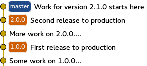
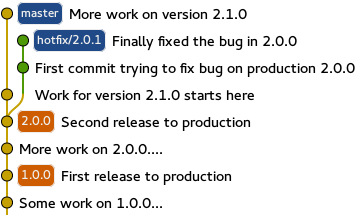
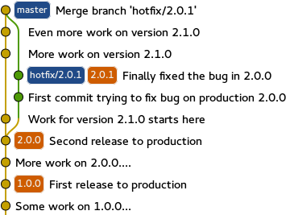
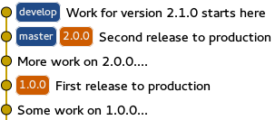
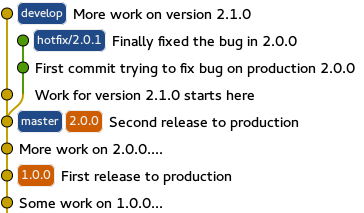
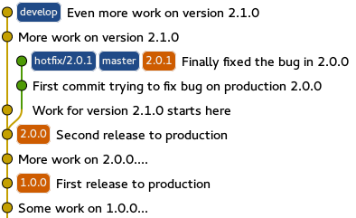

# Follow-up to 'GitFlow considered harmful' 跟进“GitFlow被认为是有害的”

[Origin](https://www.endoflineblog.com/follow-up-to-gitflow-considered-harmful)

## “I agree with the article, but we have to keep using GitFlow because your workflow can’t do X” 我同意这篇文章，但我们必须继续使用GitFlow，因为你的工作流程无法做到X

我描述的工作流程可以做到GitFlow所能做的一切。我对此非常有信心，并且这是我通过经验得知的。我认为当我说它更简单时，有些人可能会认为它是一个简化版本，为了实现简单性而牺牲了一些功能。事实并非如此；它更简单，但在分支模型的表达能力方面与GitFlow一样强大。这就是为什么我可以自信地说它比GitFlow更优越-您可以保留与之前相同的基本操作方式，只是更容易。

## “The master/develop split is needed so we can bugfix the current production version” “我们需要进行主/开发分支以便修复当前生产版本的错误。”

假设我们正在进行的某个示例项目的最后一次生产发布版本是 `2.0.0` ，目前正在进行版本 `2.1.0` 的工作。当然，这个下一个发布版本的工作正在主分支上进行，所以情况如下：

现在，灾难来临了 - 有人在生产环境中发现了一个关键的错误，并且需要尽快修复。显然，修复不应包括当前正在主分支上进行的版本 `2.1.0` 的所有进行中的工作。你该怎么办？你创建一个新的分支， `hotfix/2.0.1` ，它从标签 `2.0.0` 指向的提交开始，并在该独立分支上修复你的关键错误。假设你需要两个提交来完成修复。现在情况如下：

请注意，在整个修复bug的过程中，版本 `2.1.0` 上的工作（“更多关于版本2.1.0的工作”提交）仍然按照正常进行。这两者之间没有任何干扰。

所以你的修复程序在测试环境中部署，QA进行了检查，一切看起来都没问题。现在是时候将其部署到生产环境了。你用版本 `2.0.1` 标记 `hotfix/2.0.1` 分支的最新提交（显然），然后按照正常流程进行发布。情况如下：

再次强调，这对于仍在主分支上进行的版本 `2.1.0` 的工作没有任何影响（提交“对版本2.1.0的更多工作”）。因此，发布已完成，生产环境使用的是版本 `2.0.1` 。唯一剩下的事情就是永久地对这个更改进行版本控制。由于我们的代码库中只有一个永久分支，这只能通过将热修复合并到主分支来实现。这样，历史记录如下所示：

在这一点上，从 `hotfix/2.0.1` 可达的每个提交也可以从主分支达到，所以这个分支对历史没有任何贡献。在 `hotfix/2.0.1` 被删除后，修复错误被认为是关闭的。

## “I can’t delete my release branches” 我无法删除我的发布分支

这是另一个术语误解的案例。在GitFlow中，发布分支的概念有着非常具体的含义，并且我在我的文章中也以同样的方式使用了它。它是一个短暂存在的分支，用于准备一个单独的发布（并且以该特定发布号命名，例如， `release/1.2.3` ）。GitFlow（以及我的工作流程）的假设是，这个分支可以是短暂的，因为在它上面的更改总是会合并回主线。换句话说，每个新的发布都是基于之前所有发布的（换句话说，Git仓库中的新发布提交的祖先是所有之前发布的提交）。

现在，很多人对“发布分支”这个术语有不同的理解。这主要是因为在他们的情况下，每个新版本都不是基于之前所有版本的假设不成立。最常见的情况是在同一个代码库中维护完全独立的项目版本。比如，假设你将软件销售给个别客户，每个客户都有不同的定制需求。显然，你需要维护项目的不同版本以满足这些定制需求，但同时这些发布版本不能基于之前的所有版本，因为那样会导致不同客户的定制内容混在一起。

当仓库看起来像这样时，人们通常将保留特定客户代码版本的分支称为“发布分支”（因为这是从特定客户的分支中进行发布的分支）。最重要的是要意识到，如果你是这样工作的，你并没有使用GitFlow（因为我提到的假设失败了），所以我的帖子实际上不适用于你的情况。维护项目的完全独立版本是一个棘手的问题，没有简单的解决方案，我也不会假装有一个。只要记住，在这种情况下，我的工作流程实际上不能使用（当然，GitFlow也不能）。

## “You have to look at tags to get the latest production version” 你必须查看标签以获取最新的生产版本

很多人抱怨使用我描述的工作流程时，为了达到代码中最新发布的状态，你必须查看标签并选择最新的一个，而在GitFlow中只需 `git checkout master` 。虽然这是真的，但如果这对你很重要，这是一个非常容易解决的问题。

您创建一个额外的分支，可以称之为“current”（或者其他您想要的名称，但在本描述中我将使用“current”），它的唯一目的是指向最新的标签。工作流程完全相同，只是每当您进行热修复或发布时，需要执行一个额外的命令： `git merge <new_tag_name>` 在“current”分支上，它会将该分支快进到新创建的生产版本。这样，“current”分支始终可以被检出以达到最新的生产发布。

当人们听说这件事时，他们抱怨（我认为是正确的），对于开源项目来说，通常希望“master”扮演最新发布版本的角色。这是真的，而Git的美妙之处在于分支名称并不重要。所以你只需将“current”重命名为“master”，将“master”重命名为，比如说，“develop”。

为了避免进一步的误解，我现在会展示给你同样的图表，用来说明热修复工作流程，但是分支名称已根据这个方案进行了更改。

在发现错误之前

修复了错误，但尚未发布：

在修复发布到生产环境之后，但在热修复合并之前

合并修复后，删除分支 `hotfix/2.0.1`

请记住，我们所做的只是将之前称为“master”的分支更名为“develop”，并引入了另一个指向最新标签的分支。这就是全部，其他一切都与之前完全相同。

首先，这个评论严格来说是针对GitFlow如何使用主分支和开发分支的情境而言的。我从未说过保留多个永久分支从来没有意义 - 例如，在前一节中我提到了在同一个仓库中维护同一项目的不同版本时需要这样做。我指的是这个特定的主分支/开发分支分离是糟糕的 - 而不是每个主分支/开发分支分离。

其次，这是一种完全不同于GitFlow的使用master的方式。请注意，master从未直接提交或合并——它的变化方式只是将其快进到存储库中已有的提交。换句话说，从未有过master指向存储库中其他分支或标签无法到达的提交（与GitFlow的工作方式相反）。它从不用于开发人员的日常工作，也不以任何方式影响他们的工作流程（唯一受影响的人是执行或安排发布的人）。它只是为了更快地达到项目的生产发布而存在的便利性。这就是为什么在之前的帖子评论中，我将其称为“标记”分支——一个唯一目的是指向特定提交的分支。你可以将其视为可变的标签。再次强调——这与GitFlow中的master完全不同

最后，你实际上可以争论说在这个方案中，master是多余的。它重复了通过标签已经可以访问的信息。GitFlow的冗余之处在于这种冗余有一个明确的目的 - 让第一次克隆仓库的人能够轻松地达到项目的稳定状态。

## “The workflow you described won’t work with our CI setup” 你描述的工作流程在我们的持续集成设置中无法运行

我希望前面的部分也解决了这些问题。毕竟，你可以通过这种方式来掌握和开发，这正是GitFlow所具有的，所以它们之间应该没有区别。

## “You make good points, but I still prefer merging over rebasing” 你提出了很好的观点，但我仍然更喜欢合并而不是变基

当面临选择我所提出的合并式历史和线性历史之间时，有些人表示他们实际上更喜欢前者。在这一点上，我无法做任何事情来说服他们。如果他们更喜欢这样，那么我认为除了接受这个明显的事实，即不同的人在使用和搜索Git仓库的历史时有非常不同的方式，我们别无选择。

一个被多个评论者多次提出的不错的妥协方案是采用混合方法。基本上，在你完成了功能分支上的工作之后（也就是说，在你会在GitFlow中进行合并的时候），你首先删除远程分支（如果有的话），然后将你的更改在develop分支之上进行变基，同时清理历史记录（修正提交信息，将一些提交合并为一个等），然后再进行合并。这样，你可以兼顾两者的优点：使用变基得到的漂亮、几乎线性的历史记录，以及合并所提供的良好分离和回滚的便利性。我同意这是一个非常棒的方法；唯一让我困扰的是我不知道有没有任何强制执行它的方式。