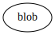
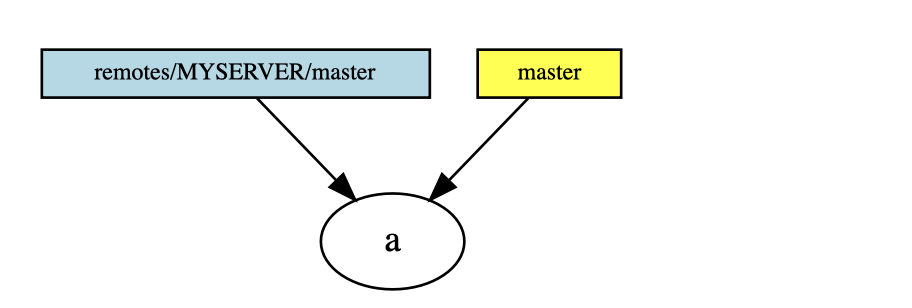

# Git for Computer Scientists

## Abstract 摘要

对于不害怕诸如有向无环图之类的术语的人，快速介绍git内部机制。

在简化形式中，git对象存储只是一个对象的有向无环图（DAG），包含几种不同类型的对象。它们都以压缩形式存储，并通过SHA-1哈希进行标识（顺便说一句，这个哈希值不是它们所代表文件内容的SHA-1，而是它们在git中的表示形式的SHA-1）。

`blob` ：最简单的对象，只是一堆字节。通常是一个文件，但也可以是一个符号链接或几乎任何其他东西。指向 `blob` 的对象决定了语义。

目录由 `tree` 对象表示。它们指向具有文件内容（文件名、访问模式等都存储在 `tree` 中）的 `blob` ，以及用于子目录的其他 `tree` 。

当一个节点在DAG中指向另一个节点时，它依赖于另一个节点：它不能独立存在。没有其他节点指向的节点可以通过 `git gc` 进行垃圾回收，或者像文件系统的inode一样被救回，没有文件名指向它们，使用 `git fsck --lost-found` 。

`commit` ：一个 `commit` 指的是提交时文件状态的 `tree` 。它还指的是0.. `n` 其他 `commit` ，它们是其父级。多个父级表示合并提交，没有父级表示初始提交，有时会有多个初始提交；这通常意味着两个独立的项目合并。 `commit` 对象的主体是提交消息。

`refs`:、头部或分支就像贴在有向无环图中节点上的便签。而有向无环图只能添加，不能修改现有节点，便签可以自由移动。它们不会存储在历史记录中，也不会直接在仓库之间传输。它们起到了一种书签的作用，表示“我正在这里工作”。

`git commit` 将一个节点添加到有向无环图(DAG)中，并将当前分支的便签移动到这个新节点上。

`HEAD` 引用是特殊的，因为它实际上指向另一个引用。它是指向当前活动分支的指针。普通引用实际上位于 `heads/XXX` 命名空间中，但通常可以省略 `heads/` 部分。

远程引用是不同颜色的便利贴。与普通引用的区别在于命名空间不同，并且远程引用基本上由远程服务器控制。更新它们的是 `git fetch` 。

`tag` ：一个 `tag` 既是DAG中的一个节点，也是一个便利贴（另一种颜色）。一个 `tag` 指向一个 `commit` ，并包括一个可选的消息和一个GPG签名。

便利贴只是一种快速访问标签的方式，如果丢失，可以从DAG中恢复。

DAG中的节点可以从存储库移动到存储库，可以以更有效的形式（packs）存储，并且未使用的节点可以进行垃圾回收。但最终，一个存储库始终只是一个DAG和便利贴。

## History 历史

那么，有了对 `git` 如何存储版本历史的了解，我们如何可视化合并等操作，以及 `git` 与试图按分支管理历史的工具有何不同。

这是最简单的存储库。我们已经创建了一个只有一个提交的远程存储库。

我们已经从远程获取了一个新的提交，但尚未合并。

合并之后的情况。由于合并是一个干净的合并（也就是说，我们在本地分支没有新的提交），唯一发生的事情就是移动了我们的便签纸，并相应地更改了我们的工作目录中的文件。

一个本地 `git commit` 和一个 `git fetch` 之后。我们既有一个新的本地提交，也有一个新的远程提交。显然，需要进行合并。

由于我们有新的本地提交，这不是一个 `fast forward` ，而是在DAG中创建了一个实际的新的 `commit` 节点。请注意它有两个父 `commit` 。

这是在两个分支上进行了几次提交和另一个合并后树的样子。看到“拼接”模式出现了吗？ `git` DAG记录了准确的操作历史。

“拼接”模式有点乏味。如果您尚未发布您的分支，或者明确告知其他人不要以此为基础进行工作，您有另一种选择。您可以 `rebase` 您的分支，其中您的提交被替换为另一个具有不同父提交的提交，并将您的分支移动到那里。

你的旧提交将保留在DAG中，直到被垃圾回收。现在先忽略它们，但要知道如果你完全搞砸了，还有一种解决办法。如果你有额外的便签指向你的旧提交，它们将继续指向它，并且使你的旧提交永远存在。尽管如此，这可能会相当令人困惑。

不要对其他人已经在其上创建了新提交的分支进行变基。虽然可以从中恢复，这并不难，但需要额外的工作可能会令人沮丧。

垃圾回收后的情况（或者只是忽略不可达的提交），并在您的 `rebase` d 分支上创建一个新的提交。

