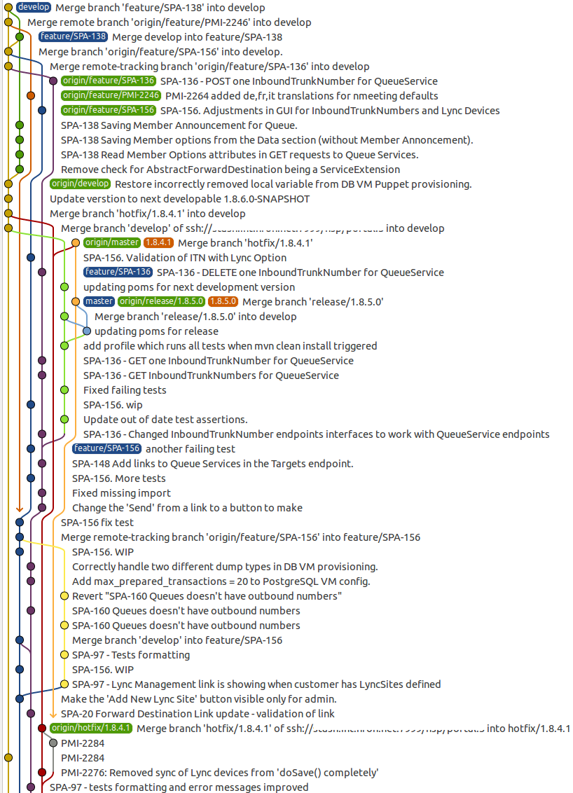

# GitFlow considered harmful

[Origin](https://www.endoflineblog.com/gitflow-considered-harmful)

我对此深感失望-我认为这是一个对不存在问题的奇怪、过度工程化的解决方案。我无法看到使用这种繁重方法的任何好处。我很快就对这篇文章不屑一顾，继续按照我一直使用的方式使用Git（我将在本文后面描述这种方式）。

## GitFlow’s mistakes GitFlow的错误

### 它使项目的历史完全无法阅读

GitFlow的最糟糕的部分就是这个建议

[A successful Git branching model](A successful Git branching model.md)

> 已完成的功能可以合并到开发分支中，以确保将它们添加到即将发布的版本中
>
> (…)
>
> ```
> $ git merge --no-ff myfeature
> ```
>
> (…) （...）
> `--no-ff` 标志会导致合并始终创建一个新的提交对象，即使可以通过快进方式进行合并。

这段话单独造成的损害比文章其他部分加起来还要大。由于这个“建议”（被呈现为一种绝对和显而易见的真理，实际上只是基于观点的惯例，而且还不受欢迎），使用GitFlow管理的项目的历史开始变得像一团巨大的意大利面。试着找出项目是如何从这样的状态发展起来的



这并不是我作为一个应用GitFlow原则所见过的最糟糕的混乱情况 - 实际上离最糟糕还很远。我只是随便找了一个容易找到的例子 - 这个截图捕捉到了我目前参与的一个项目的最新状态。在这样的历史记录中找到任何东西几乎是不可能的。而这只是一个小团队（约7名开发人员） - 想象一下对于一个更大的团队来说会更糟糕。GitFlow的作者说他在他的个人项目中使用它。也许他只是从未需要扩展这种方法，因此从未意识到随着每个新成员的加入，所创建的混乱会呈指数增长。或者也许他从未需要在GitFlow将你的项目历史变成无形迷宫中搜索某些东西。

幸运的是，人们很快就意识到这些合并提交可能并不像它们被呈现的那样好，几乎没有人再关注关于 `--no-ff` 标志的建议（至少在我的经验中是如此）。不幸的是，用户的心态已经受到了损害 - 他们已经被训练成认为简单、线性的历史比这个合并提交的地狱更差，而且被劝阻学习和使用像挑选和变基这样的东西 - 因为对他们来说，混乱的历史似乎是不可避免的（或者更糟糕的是，它开始变得实际上是可取的，以增加项目和工作的感知难度 - 再次强调，他们想要显得“专业”）。更重要的是，由于在GitFlow中使用了不必要的大量分支（见下文），历史记录中仍然有大量的合并提交。

### The master/develop split is redundant

GitFlow主张有两个永久分支 - master和develop。为什么要有两个，而不是一个传统的标准呢？使用了一年后，我仍然不知道。而且，我现在可以确定的是，与只有一个分支相比，有两个分支并没有任何收益。

> 当开发分支中的源代码达到稳定点并准备好发布时，所有的更改都应该以某种方式合并回主分支，然后标记一个发布版本号。具体如何完成将在后续讨论中进一步说明。
> 因此，每次将更改合并回主分支时，根据定义，这就是一个新的生产发布。我们倾向于对此非常严格，因此理论上，我们可以使用Git钩子脚本，在主分支上提交时自动构建和部署我们的软件到生产服务器。

如果你仔细分析这两段文字，我认为你会同意我的观点：主分支对历史没有任何贡献。想想看：如果每次提交到主分支都是从开发分支发布的新版本，并且每次提交到主分支都有标签，那么你在开发分支和这些标签中已经拥有了所有你所需的信息。在这一点上，保留主分支没有任何有价值的意义。

然而，这样做只会产生更多无用的合并提交，使你的历史记录变得更加难以阅读，并给工作流程增加了相当复杂性。这也是我对GitFlow最后、最大的抱怨。

### It’s needlessly complex 这是不必要的复杂

所有这些使用强制GitFlow的分支都需要一套复杂的规则来描述它们的交互。这些规则，再加上难以捉摸的历史，使得开发人员在日常使用GitFlow时非常困难。

你能猜到每当你建立一个像那样复杂的规则网络时会发生什么吗？没错 - 人们会犯错误并无意中违反这些规则。在GitFlow的情况下，这种情况经常发生。以下是我观察到的最常见的错误的简短列表，这并不是详尽无遗的。这些错误经常重复出现，有时每天都会发生，通常是由同一批开发人员一次又一次地犯下 - 这些开发人员在其他软件领域通常非常有能力。

* 由于合并过程中发生冲突并且无法找到正确的历史版本，因此撤销他人的更改
* 将更改实际推送到哪个分支感到困惑（这种情况经常发生，可以称之为“标准”错误）
* 从错误的初始分支开始创建支持分支，或通过合并到错误的最终分支来完成支持分支
* 忘记给发布打标签（因为主分支上有一个提交，对吧？），然后不小心直接修改了原有的发布，而不是创建一个新的
* 不从后来标记为（假定的）发布号的提交中构建实际发布版本

## Anti-gitflow 反对GitFlow

* 只有一个永恒的分支 - 你可以称之为主分支、开发分支、当前分支、下一个分支 - 无论如何。我个人喜欢“主分支”，这是我在接下来的描述中将使用的名称，因为在Git世界中，这已经成为惯例，并立即传达了它的目的。
* 所有其他分支（功能、发布、热修复以及其他你需要的分支）都是临时的，只是为了方便与其他开发人员共享代码和作为备份措施而存在。一旦这些分支上的更改合并到主分支上，它们就会被删除。
* 主要将功能集成到主分支上，以保持历史线性。您在如何执行此操作方面有很大的自由。您可以将其简单地作为一种约定，鼓励开发人员遵循，但不强制执行。另一方面，如果您使用像Gerrit这样的工具来管理Git仓库（即使您不进行代码审查，我也建议使用它-权限系统非常出色，如果您决定进行代码审查，开始进行代码审查将非常容易），您可以设置权限，实际上禁止将合并提交推送到主分支，从而确保历史线性。
* 发布的方式与GitFlow类似。您为发布创建一个新的分支，从master中选择具有所有必要功能的点进行分支。从那时起，新的工作，针对下一个发布的目标，像往常一样推送到master，并且任何必要的更改都会推送到发布分支( 在我看来，如果您的发布需要单独的提交才能工作，那是一种反模式和一个巨大的警示信号，但这是另一篇文章的话题-为简单起见，让我们假设您不能或不想改变这一点）。最后，一旦发布准备就绪，您会给发布分支打上标签。然后，因为只有一个永恒的分支，只有一种方法可以使您的发布永久版本化-那就是将发布分支合并到master并推送更改后的master。之后，所有在发布期间进行的更改现在都是master的一部分，发布分支被删除。)

* 热修补非常类似于发布，只是你不是从主分支的任意提交中创建分支，而是从你想要修复的发布标签中创建分支。同样，主分支上的工作仍然按常规进行，必要的修复会被推送到热修补分支。一旦修复完成，流程与发布完全相同 - 给分支顶部打上一个新的发布标签，将其合并到主分支，然后删除热修补分支。

正如你所看到的，这个工作流程与GitFlow非常相似，但试图避免之前提到的问题。线性历史使合并和/或变基更容易，而只有一个永久分支则消除了许多复杂的规则。项目的状态是清晰的 - master的顶部是下一个发布的内容，最新的标签是生产环境中的内容。尽管这个工作流程更简单，但与GitFlow相比，在管理项目历史的表达能力方面并没有丢失任何东西 - 相反，历史更有用，因为鼓励保持线性使搜索变得更容易。