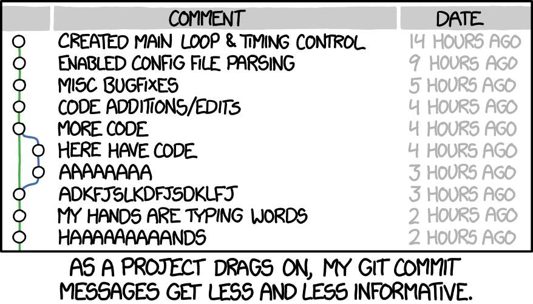

# How to Write a Git Commit Message



**由OPENAI翻译**

如果你浏览任何随机 Git 存储库的日志，你可能会发现它的提交消息或多或少是混乱的。例如，看看我早期致力于 Spring 时的这些宝石

```
$ git log --oneline -5 --author cbeams --before "Fri Mar 26 2009"

e5f4b49 Re-adding ConfigurationPostProcessorTests after its brief removal in r814. @Ignore-ing the testCglibClassesAreLoadedJustInTimeForEnhancement() method as it turns out this was one of the culprits in the recent build breakage. The classloader hacking causes subtle downstream effects, breaking unrelated tests. The test method is still useful, but should only be run on a manual basis to ensure CGLIB is not prematurely classloaded, and should not be run as part of the automated build.
2db0f12 fixed two build-breaking issues: + reverted ClassMetadataReadingVisitor to revision 794 + eliminated ConfigurationPostProcessorTests until further investigation determines why it causes downstream tests to fail (such as the seemingly unrelated ClassPathXmlApplicationContextTests)
147709f Tweaks to package-info.java files
22b25e0 Consolidated Util and MutableAnnotationUtils classes into existing AsmUtils
7f96f57 polishing
```

将其与同一存储库中最近的提交进行比较：

```
5ba3db6 Fix failing CompositePropertySourceTests
84564a0 Rework @PropertySource early parsing logic
e142fd1 Add tests for ImportSelector meta-data
887815f Update docbook dependency and generate epub
ac8326d Polish mockito usage
```

前者的长度和形式各不相同；后者简洁而一致。

前者是默认发生的情况；后者绝不会偶然发生。

这些存储库的贡献者知道，精心设计的 Git 提交消息是向其他开发人员（实际上是向他们未来的自己）传达有关更改的上下文的最佳方式。差异会告诉您发生了什么变化，但只有提交消息才能正确地告诉您原因。

重新建立一段代码的上下文是浪费的。我们无法完全避免它，所以我们应该努力[尽可能]减少它。提交消息正是可以做到这一点，因此，提交消息可以显示开发人员是否是良好的协作者。

如果您没有仔细考虑过什么是优秀的 Git 提交消息，那么您可能没有花太多时间使用 `git log` 和相关工具。这里存在一个恶性循环

因为提交历史记录是非结构化且不一致的，所以人们不会花太多时间使用或处理它。而且由于它没有被使用或照顾，所以它仍然是非结构化和不一致的。

但是，一个被精心照料的日志是一件美丽而有用的东西。随之而来的是， `git blame` ， `revert` ， `rebase` ， `log` ， `shortlog` 和其他子命令变得生动起来。审查他人的提交和拉取请求变得值得做，并且突然可以独立完成。理解为什么几个月或几年前发生的事情不仅变得可能，而且变得高效。

一个项目的长期成功（除其他因素外）取决于其可维护性，而维护者拥有的工具中，项目日志是最强大的之一。值得花时间学习如何正确地管理它。起初可能会有些麻烦，但很快就会变成习惯，并最终成为所有参与者的骄傲和生产力的源泉。

在这篇文章中，我只讨论保持一个健康的提交历史的最基本要素：如何编写单个的提交信息。还有其他重要的实践，比如合并提交，我在这里没有讨论。也许我会在以后的文章中谈到这个。

大多数编程语言都有明确的惯用风格，例如命名、格式等。当然，这些惯用风格会有所不同，但大多数开发者都认同选择一个并坚持下去要比每个人都按自己的方式做要好得多。

一个团队对待其提交日志的方法应该没有任何不同。为了创建一个有用的修订历史，团队首先应该就一个提交消息约定达成一致，该约定至少定义以下三个方面：

* 样式。标记语法，包裹边距，语法，大写，标点符号。将这些事情详细说明，消除猜测，并尽可能简化。最终结果将是一个非常一致的日志，不仅阅读起来愉快，而且实际上会定期被阅读。
* 内容。提交消息的正文（如果有的话）应包含什么样的信息？不应包含什么？
* 元数据。问题跟踪ID、拉取请求编号等应如何引用？

## 一个优秀的Git提交信息的七个规则

* [Separate subject from body with a blank line
  用空行将主题与正文分开](https://cbea.ms/git-commit/#separate)
* [Limit the subject line to 50 characters
  限制主题行为50个字符](https://cbea.ms/git-commit/#limit-50)
* [Capitalize the subject line
  将主题行首字母大写](https://cbea.ms/git-commit/#capitalize)
* [Do not end the subject line with a period
  不要在主题行末尾加句号](https://cbea.ms/git-commit/#end)
* [Use the imperative mood in the subject line
  在主题行中使用祈使语气](https://cbea.ms/git-commit/#imperative)
* [Wrap the body at 72 characters
  将正文每行限制在72个字符内](https://cbea.ms/git-commit/#wrap-72)
* [Use the body to explain *what* and *why* vs. *how*
  使用身体来解释什么和为什么，而不是如何。](https://cbea.ms/git-commit/#why-not-how)

```
Summarize changes in around 50 characters or less

More detailed explanatory text, if necessary. Wrap it to about 72
characters or so. In some contexts, the first line is treated as the
subject of the commit and the rest of the text as the body. The
blank line separating the summary from the body is critical (unless
you omit the body entirely); various tools like `log`, `shortlog`
and `rebase` can get confused if you run the two together.

Explain the problem that this commit is solving. Focus on why you
are making this change as opposed to how (the code explains that).
Are there side effects or other unintuitive consequences of this
change? Here's the place to explain them.

Further paragraphs come after blank lines.

 - Bullet points are okay, too

 - Typically a hyphen or asterisk is used for the bullet, preceded
   by a single space, with blank lines in between, but conventions
   vary here

If you use an issue tracker, put references to them at the bottom,
like this:

Resolves: #123
See also: #456, #789
```

### 1. Separate subject from body with a blank line

虽然不是必需的，但最好在提交消息中以一行简短的（少于50个字符）概括变更的内容开始，然后是一个空行，然后是更详细的描述。在提交消息中第一个空行之前的文本被视为提交标题，并且该标题在Git中被使用。例如，Git-format-patch（1）将提交转换为电子邮件，它在主题行中使用标题，在正文中使用提交的其余部分。

首先，并不是每个提交都需要有主题和正文。有时候只有一行就足够了，特别是当改动非常简单，不需要进一步的上下文时。例如：

```
Fix typo in introduction to user guide
```

### 2. Limit the subject line to 50 characters

50个字符并不是一个严格的限制，只是一个经验法则。保持主题行在这个长度范围内可以确保其可读性，并迫使作者花一点时间思考如何以最简洁的方式解释正在发生的事情。

*提示：如果你在总结时遇到困难，可能是因为你一次性进行了太多的更改。努力实现原子提交（关于这个话题的单独帖子,*[atomic commits](https://www.freshconsulting.com/atomic-commits/)*）*

GitHub的用户界面完全了解这些约定。如果您超过50个字符的限制，它会警告您。

并且将超过72个字符的主题行截断为省略号：

### 3. Capitalize the subject line

### 4. Do not end the subject line with a period

### 5. Use the imperative mood in the subject line

命令语气只是指“以命令或指示的口吻说或写”

命令式的语气可能听起来有点粗鲁，所以我们不经常使用它。但是对于Git提交的主题行来说，它非常合适。其中一个原因是，Git在代表你创建提交时总是使用命令式的语气。

**A properly formed Git commit subject line should always be able to complete the following sentence**:
一个正确格式的Git提交主题行应该能够完成以下句子：

- If applied, this commit will *your subject line here*
  如果应用，此提交将在此处填写您的主题行

请记住：只有在主题行中使用祈使句是重要的。在写正文时，您可以放松这个限制。*

### 6. Wrap the body at 72 characters

Git不会自动换行文本。当你编写提交信息的正文时，必须注意右边界，并手动换行文本。

建议将此设置为72个字符，这样Git在保持整体字符数不超过80个字符的同时，有足够的空间缩进文本。

### 7. Use the body to explain what and why vs. how

在大多数情况下，你可以省略关于如何进行改变的细节。在这方面，代码通常是自解释的（如果代码如此复杂以至于需要用散文来解释，那就是源代码注释的用途）。只需专注于清楚地说明你首次进行改变的原因 - 改变之前的工作方式（以及其中存在的问题），现在的工作方式以及你为什么决定以你所选择的方式来解决它。

未来感谢你的维护者可能就是你自己！

### Learn to love the command line. Leave the IDE behind.

### 学会喜欢命令行。抛弃集成开发环境。

有多少个Git子命令就有多少个原因，值得拥抱命令行。Git非常强大；集成开发环境也是，但它们各有不同的优势。我每天都使用一个IDE（IntelliJ IDEA），也广泛使用其他IDE（Eclipse），但我从未见过能够与命令行（一旦你掌握了它）相媲美的Git集成。

某些与Git相关的IDE功能是非常宝贵的，比如在删除文件时调用 `git rm` ，以及在重命名文件时执行正确的 `git` 操作。但当你开始尝试通过IDE进行提交、合并、变基或进行复杂的历史分析时，一切都会崩溃。

谈到发挥Git的全部威力时，只能通过命令行来实现。