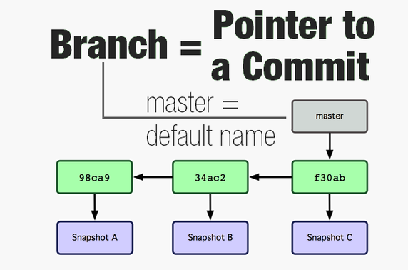
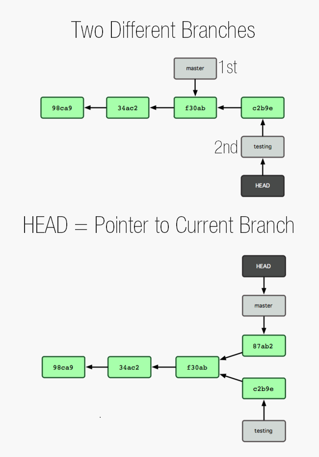

# How to explain git in simple words?

[origin](https://xosh.org/explain-git-in-simple-words/)

Git只是一个单链表，其中节点（提交）是添加到头指针而不是尾部。多个节点可以指向同一个节点，这样就创建了多个头指针（分支）。您可以创建任意数量的指针（分支）。您甚至可以拥有常量指针（标签）。每个节点（提交）包含下一个节点（上一个提交）内容的SHA，因此如果您修改一个节点的内容，您必须修改指向它的所有节点。这就是git的基本原理。

文件的所有内容都存储在一个称为 `blob` 的东西中。当文件发生变化时，一个新的blob将存储包含所有新变化的完整文件。Blob是Git中的基本存储单元之一。其他的单元/对象类型包括Commit和Tree。

## Hash 哈希

你在git中到处看到一个类似的奇怪字符串或其简写形式。这是SHA1（哈希）。哈希可以指向一个blob、一个commit或一个tree。它有40个字符，但通常只需要几个字符就足以标识一个commit。例如，GitHub显示前10个字符。

## Tree 树

文件始终存储在某个目录或文件夹中。文件夹也可以包含更多的目录。类似地，git中的 `tree` 表示用于存储blob和更多树的目录。

总是有一个根上的树，指向包含东西的树。

## Commit

现在假设你有两个文件。你希望以一种方式保存它们，以便以后任何时候都可以恢复到完全相同的状态。当你用git保存它的快照时，会创建一个指向包含两个blob（我们称之为blob1和blob2）的树的 `commit` 。每个提交都有自己的哈希值，它还保存了你的消息、时间戳和你的信息。

当你修改一个文件（blob1）并提交时，git会将完整的文件再次存储在一个新的blob（blob1c）中。一个新的树被创建，其中包含一个指向blob2和新的blob1c的新哈希。现在你的git仓库中有文件的两个版本。

### Check in = Do a Commit 签到 = 提交

Check in is simply another name for doing a commit in the repository.
签入只是在代码库中进行提交的另一个名称。

### Check out = Load a Commit 查看 = 加载一个提交

Similary Check out is the process of loading a commit from the repository.
类似地，检出是从仓库加载提交的过程。

### Working directory 工作目录

This the git directory in which you are working. When you check-out a commit, your whole directory with all files is changed/replaced to match that commit *(except ignored files)*.
这是你正在工作的git目录。当你检出一个提交时，你的整个目录和所有文件都会被改变/替换以匹配该提交（除了被忽略的文件）。

### Stage OR Index 阶段或指数

索引是您提议的下一个提交。它是实际提交之前的缓冲区。基本上，它是一个装货码头，您可以确定哪些更改要发送。由于工作目录和Git保存的内容基本上是解耦的，这使得开发人员可以根据自己的需求构建提交。您甚至可以从您的多个更改中暂存单个行，并仅提交该行。

More details What is the deal with the Git Index? What is the Git Index? - GitGuys http://www.gitguys.com/topics/whats-the-deal-with-the-git-index/
更多细节 Git索引是什么？Git索引是什么？- GitGuys http://www.gitguys.com/topics/whats-the-deal-with-the-git-index/

More Details: 更多细节：

[Git Object: Git Commit - GitGuys](https://waybackmachine.org/web/20160902075749/http://www.gitguys.com/topics/git-object-commit/) [Anotomy of a Commit](https://blog.thoughtram.io/git/2014/11/18/the-anatomy-of-a-git-commit.html)
Git对象：Git提交 - GitGuys提交的解剖

**Index is the buffer before commit.
索引是提交之前的缓冲区。**
## History

如果您进行一些更改并再次提交，新的提交也将指向先前的提交。因此，每个新的提交只知道其前一个提交（类似于“链表”或“树”）。当您不断更改文件时，一系列的提交维护了每个提交中所做的内容。您可以随时加载任何先前的提交。

Commits are connected in chain keeping history of changes
提交被连接在一起，保留了变更的历史记录

## Branch 分支

我们之前已经看到，提交链可以朝多个方向发展，形成多个分支。但请注意，每个提交只知道它的前一个提交。如果你加载了“commit4”，你可以回到“commit2”，但是除非你在某个地方存储了它的地址，否则你无法到达“commit3”。用于跟踪不同分支的东西被简单地称为 `branch` 。

分支只是一个可移动的指针，它始终指向该分支中最新的提交。每次提交时，它都会移动到最新的提交上。Git将默认分支命名为 `master` 。

HEAD指向的是当前所加载的分支或提交，它始终指向你当时所在的提交或分支。

### Visualizing branches 可视化分支

许多GIT图形界面工具（如SmartGit）可以显示分支和提交的图形表示，以便轻松查看它们之间的连接。

## Tag (Bookmark) 标签（书签）

将 `tag` 视为书签。分支是可移动的指针，而标签是不可移动的指针，始终指向一个特定的提交。标签用于指定一个版本。例如，在进行了许多提交和修复之后，您可以将一次一切正常的提交标记为 `version 1.0` 。

## Rebase (Move) 重新基准（移动）

每个提交（除了第一个）都依赖于前一个提交，我们可以称之为基础提交。简单来说，变基将所有提交移动到另一个点或另一个提交。

通常情况下，您会将一个分支变基到主分支的最新版本。请注意，在变基过程中，整个移动的提交集将被重新创建，以便它们可以完美地放置在新的基础之上。

## Merge 合并

并通常是重置的替代方法。而不是移动该功能分支，会创建一个新的“合并”提交，连接两个分支。这个新的提交由两个分支分别进行的所有更改组成。可能会出现合并冲突，必须解决才能成功创建合并提交。

## Remote 远程

多个人可以在一个git仓库上工作。每个人都会得到整个仓库的副本。通常设置如下。有一个中央仓库，每个想要在其上工作的人都在自己的计算机上克隆（复制）它。对于每个人来说，他们从中复制的原始仓库是一个 `remote` 仓库。

### Clone and Fork 克隆和分叉

克隆是复制存储库的过程。克隆后，原始存储库被添加为其远程存储库。可以在该远程存储库上执行推送和拉取操作。分叉只是GitHub或Bitbucket中使用的不同名称，它将存储库克隆到您的GitHub帐户而不是您的计算机上。

### Fetch 获取

从远程获取更新/更改的过程称为 `fetch` 。当获取到最新的提交时，它们会被下载到用户的计算机上，并存储在一个单独的分支中，用于跟踪远程的更改。这些更改可以通过 `merge` 命令应用。定期获取是一种常见的做法，以便与其他人对存储库的操作保持同步。

### Pull 拉

拉取下载更改并自动一次性应用它们。基本上是 `fetch` 和 `merge` 一步完成。

### Push 推

推送是将您的更改上传到远程存储库的过程。