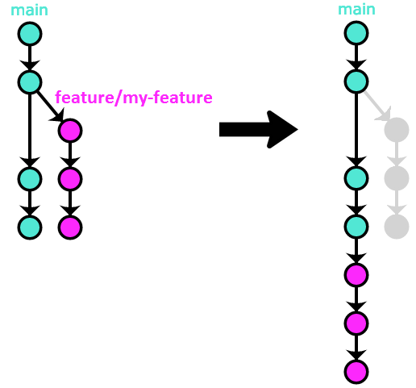
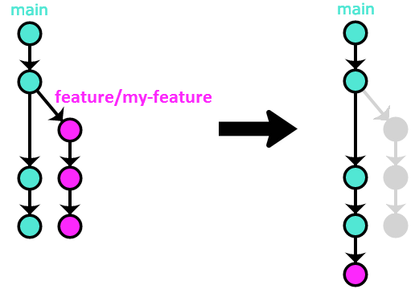
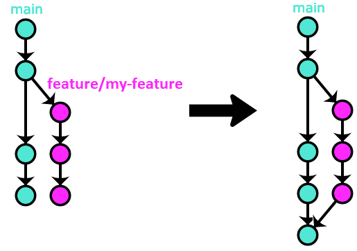

# Implementing OneFlow on GitHub, BitBucket and GitLab

[Origin](https://www.endoflineblog.com/implementing-oneflow-on-github-bitbucket-and-gitlab)

我再次介绍OneFlow，但这次假设你正在使用像GitHub、BitBucket或GitLab这样的托管Git提供商。

传统上，主分支被称为 `master` ，这也是Git本身的默认名称。然而，由于该术语的负面历史含义， `main`正在取代 `master` 成为新的默认名称。

在具有两个长期分支的变体中，主分支的名称传统上是 `develop` ，这个名称来自GitFlow

在下面的描述中，我将使用 `main` 作为主要长期分支的名称。然而，实际使用的名称可以是任何名称，无论是 `master` ， `mainline` ， `develop` 还是其他名称，工作流程都是相同的。

## Forks 叉子

在像GitHub、BitBucket和GitLab这样的托管Git提供商的世界中，有一个概念对于向这些平台上托管的项目贡献代码至关重要：分支。

当您将项目的Git存储库托管在私有企业网络中的服务器上时，通常不会区分对该存储库的读取和写入权限。通常情况下，对给定存储库具有网络访问权限的每个人都自动具有对其的推送权限 - 默认情况下，Git不包含区分读取和写入操作的权限模型。假设是，由于网络对公司来说是私有的，因此对其的访问自动授予对其中托管的任何存储库的完全访问权限。对于私有托管的存储库来说，这通常是一个安全的假设。

然而，当您的代码库存储在像GitHub、BitBucket或GitLab这样的公共托管解决方案中时，这个假设就不再成立。公共代码库可以被所有人阅读，但这并不意味着它们应该被所有人写入 - 这意味着这些项目的代码可以被互联网上的任何人更改，显然这是不实际的。

对于使用任何托管提供商创建的存储库，只有所有者有权限向该存储库推送。当然，他们可以选择与其他用户或团队共享这些权限。对于给定项目的存储库具有写权限的用户集合通常被称为其维护者（与只具有读权限的贡献者相对）。

但是这种权限模型存在一些问题，因为能够推送到你正在工作的存储库是很重要的；至少，你希望能够将你创建的提交推送到某个地方，这样你的工作就不会在你的机器出现故障时丢失。

托管提供商通过分叉解决了这个问题。分叉只是给定存储库的一个副本，但完全存在于您的帐户中。分叉包含创建分叉时原始存储库默认分支的所有提交。但由于这个副本放在您的帐户中，您可以对其进行推送访问。

通常的设置方式是有两个独立的Git远程仓库：一个是指向原始仓库的，通常称为 `origin` 或 `upstream`，另一个是指向你的分支仓库的，通常只称为 `fork` 。

为了更具体，假设你想为NodeJS开源项目做贡献。你可以开始克隆存储库，该存储库托管在GitHub上。

```shell
$ git clone git@github.com:nodejs/node.git
```

在您的本地文件系统中创建的Git存储库位于 `node` 目录中，将 `origin` 作为 `git@ github.com:nodejs/node.git` 远程。在您的GitHub帐户中分叉NodeJS存储库之后，您现在需要将此分叉添加为第二个远程。

```shell
$ git remote add fork git@github.com/yourusername/node.git
```

一个重要的注意事项：即使你是一个项目的维护者，因此对其仓库具有推送权限，我仍然建议你使用一个分支。原因是，如果维护者在主仓库中使用其功能和备份分支，那么该仓库会变得非常混乱，非常快速。实际上，从你的仓库获取的人们没有理由下载所有维护者创建的随机分支，其中许多分支的名称不好，比如 `adam/fix-that-stupid-bug` 。如果每个人都使用分支来处理这些类型的分支，主仓库就能保持整洁。

## Feature branches 特性分支

特性分支是项目中大部分日常工作发生的地方，因此是最常见的短期分支类型。

### 开始一个功能分支

Feature branches always start from the primary long-lived branch, which is called `main` in our example:
特性分支始终从主要的长期存在的分支开始，我们的示例中称为 `main`

```shell
$ git checkout -b feature/my-feature main
```

您可以将您的功能分支推送到您的分叉版本，这样即使您的计算机出现故障，也不会丢失

```shell
$ git push -u fork feature/my-feature
```

 `-u` 参数将 `fork/feature/my-feature` 设置为 `feature/my-feature` 的追踪分支，这意味着以后，每当你检出 `feature/my-feature` 分支时，你可以简单地调用 `git push` 来更新你的分支中的最新功能版本）

### Updating a feature branch

要将您的功能实际合并到项目中，您需要提交一个包含您功能分支内容的拉取请求（请注意，GitLab将其称为“合并请求”，但除了名称外，它们完全相同）。拉取请求是使用您项目所使用的托管提供商的Web界面打开的。源分支是您分叉中的功能分支（在我们的示例中为 `feature/my-feature` ），目标分支是主存储库中的主要长期分支（在我们的示例中为 `main` ）-由于分叉，所有托管提供商都允许以这种方式在存储库之间创建拉取请求。

拉取请求是您提交给拥有该项目的团队的建议。您可能也是该团队的成员！您建议根据您的功能分支修改项目的代码。维护人员在合并之前对您的提交进行代码审查；拉取请求还可以对您的建议更改运行自动化检查，如单元测试、代码覆盖要求、代码检查工具、静态分析等。

虽然团队有可能会直接接受您的拉取请求，但最常见的情况是评审人员会在您的代码上留下一些评论，要求您在合并之前进行一些更改。在这种情况下，您需要在本地进行更改，将其提交到您的功能分支，然后更新您的拉取请求。更新的方法是再次将您的功能分支推送到您的分叉上：

```shell
$ git checkout feature/my-branch
# do some work, adding more commits to the branch...

# update your Pull Request:
$ git push fork feature/my-branch

# if you used the -u option as suggested above,
# and you have the feature/my-branch checked out locally,
# you can use a shortcut:
$ git push

# if you used `git commit --amend`,
# or `git rebase -i` to edit the commits on your feature branch
# instead of creating new ones,
# you will need to force-push your branch instead:
$ git push -f fork feature/my-feature
```

由于您提交拉取请求和进行审核和更新之间可能会有一段时间，如果在此期间主分支发生了变动，您可能还想将您的功能分支更新为最新的主分支。有两种主要的方法可以实现这一点，使用哪种方法基本上是个人偏好的问题 - 合并或变基。

```shell
$ git fetch origin
$ git checkout feature/my-feature

# option 1 - merge:
$ git merge origin/main

# option 2 - rebase:
$ git rebase origin/main
```

请注意，如果您使用rebase，您将需要强制推送您的特性分支到您的分叉以更新拉取请求： `git push -f fork feature/my-feature` 。

### Finishing a feature branch 完成一个功能分支

一旦您的提交得到项目团队的批准，并且自动检查全部通过，合并请求就可以进行合并。

#### Option #1 – rebase / merge `--ff-only` 选项1 - 变基/合并 `--ff-only`



最终结果是一个线性的历史记录，但其中包含了Pull Request的每个提交。由于Pull Request在最终被接受之前可能经历了很多次审查，我对这种方法并不是特别喜欢，因为它会将整个过程中创建的所有提交都作为永久项目历史的一部分，使得历史记录变得混乱。

#### Option #2 – merge `--squash` 选项#2 - 合并

这个变种与rebase类似，但有一个关键的区别 - 所有来自Pull Request的提交都会合并为一个包含所有更改的单个提交：

由于这种方法保留了线性历史，同时也解决了使用rebase方法时的问题（将每个PR的每个小提交都添加到项目的永久历史中），所以这是我首选的Pull Requests集成方法。



#### 选项#3 - 合并



在我看来，这种方法没有任何优点，而且有非常严重的缺点（由于合并提交的增加，历史记录变得混乱且无法搜索，所有来自所有PR的微小提交都会被添加到项目的永久历史记录中），所以我不建议使用它。

基于这些原因，我推荐选择“合并”变体（选项#2）而不是这个。

以下省去基本相同