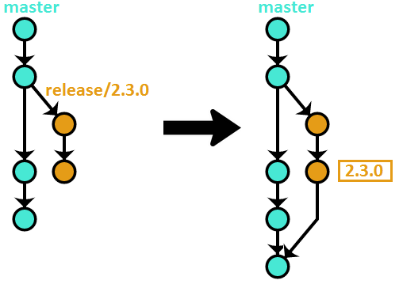

# OneFlow – a Git branching model and workflow

[OneFlow – a Git branching model and workflow](https://www.endoflineblog.com/oneflow-a-git-branching-model-and-workflow)

本文旨在成为一个全面和详细的参考，但核心分支模型与原始文章中描述的完全相同。

## Introduction 介绍

OneFlow被构想为GitFlow的简化替代方案。然而，请不要将“简化”理解为“能力较弱”。OneFlow的分支模型与GitFlow的一样强大。使用GitFlow可以做到的任何事情，都可以用OneFlow以更简单的方式实现。下面的描述会更详细地说明。

正如其名，OneFlow的基本前提是在您的代码库中只有一个永恒的分支。

### OneFlow advantages OneFlow的优势

维护一个长期存在的单一分支大大简化了开发人员需要执行的版本控制方案和日常操作

### When to use OneFlow 何时使用OneFlow

使用OneFlow进行项目的主要条件是每个新的生产发布都基于上一个发布（GitFlow也有完全相同的要求）。绝大多数软件项目都满足这个条件。例如，如果您的项目是一个Web应用程序，那么OneFlow应该非常适合。大多数开源项目也可以使用OneFlow进行版本控制。

### When NOT to use OneFlow 何时不使用OneFlow

首先，当上述条件（“每个新的生产发布版本都基于上一个版本”）不满足时。以Python编程语言为例。它有两个不兼容的版本，2和3。它们都接收错误修复和安全补丁 - 然而，这并不意味着Python 3的新版本是基于Python 2最新发布的提交。这两个版本已经分道扬镳，虽然它们肯定共享很多代码，但不能说一个版本是基于另一个版本（从纯粹的版本控制角度来说）。

如果您的项目需要同时维护多个不兼容的发布版本，那么OneFlow无法直接适用于您的项目。您可以确保使用其中的元素 - 例如，可能可以使用OneFlow来管理每个单独的版本。然而，在这类项目中，主要的挑战通常在于版本之间的交互以及如何有效地在它们之间共享代码，而OneFlow并不是为解决这个问题而设计的。

## Detailed description 详细描述

就像之前解释的那样，工作流只使用一个永久分支。名称无关紧要，可以是任何你想要的。在这个描述中，我们将使用 `master` ，因为它可能是最常见的名称，而且已经是Git的约定，但你也可以使用，例如， `current` ， `default` ， `mainline` ，或其他任何名称。

### Feature branches 特性分支

特性分支（有时也称为主题分支）是日常开发工作发生的地方 - 因此，它们是所有支持分支中最常见的。它们用于开发即将发布的新功能和错误修复。它们通常命名类似于 `feature/my-feature` 

#### Starting a feature branch 开始一个功能分支

要启动一个特性分支，只需从 `master` 创建一个新的分支：

```bash
$ git checkout -b feature/my-feature master
```

#### Finishing a feature branch 完成一个功能分支

一旦完成了给定功能的工作，就需要将其集成回 `master` 中。有几种方法可以实现这一目标。

注意：就工作流而言，特性分支集成方法的选择并不重要。它应该基于个人或团队的偏好，然而无论选择哪个选项，分支模型的工作方式都是完全相同的。我个人的建议是使用选项#1。

##### Option #1 – rebase 选项#1 - 变基

该方法使用Git的 `rebase` 命令（带有 `-i` 开关，表示交互式）将特性分支与 `master` 集成：

```bash
$ git checkout feature/my-feature
$ git rebase -i master
$ git checkout master
$ git merge --ff-only feature/my-feature
$ git push origin master
$ git branch -d feature/my-feature
```


该方法的优点：

- 在与主分支集成之前进行变基操作可以在将其公开之前清理分支历史，从而使最终历史更好地落地在 `master` 上。
- 线性历史使事情变得更简单，更容易找到，尤其是在查看每个文件的历史记录时。

Disadvantages: 缺点：

* 还原整个功能需要还原多个提交。

##### Option #2 – merge –no-ff

这是GitFlow所倡导的方法。

```bash
$ git checkout master
$ git merge --no-ff feature/my-feature
$ git push origin master
$ git branch -d feature/my-feature
```

视觉上：


该方法的优点：

- 还原整个功能只需要还原一个提交（合并提交）。

Disadvantages: 缺点：

- 功能分支的历史记录通常很混乱，直接放在 `master` 上。
- 合并提交的增加（特别是在项目开发人员数量增加的情况下）使得历史记录难以管理。

##### 选项#3 - 变基 + 合并 -no-ff

这种方法是前两种方法的结合，试图保留它们的优点同时摆脱缺点

```bash
$ git checkout feature/my-feature
$ git rebase -i master
$ git checkout master
$ git merge --no-ff feature/my-feature
$ git push origin master
$ git branch -d feature/my-feature
```

视觉上：


该方法的优点：

* 干净而几乎是线性的历史。

- 一个提交就可以轻松还原整个功能。

缺点：

- 这种方法在程序上很难强制执行，因此必须依赖最大努力的约定。

最后，无论使用何种方法，如果功能分支已经推送到中央仓库，现在需要将其删除

```bash
$ git push origin :feature/my-feature
```

### Release branches 发布分支

发布分支是为了准备软件的发布而创建的。显然，具体意义因项目而异。这可能只是在配置中增加版本号，或者涉及到代码冻结、生成发布候选版本和进行完整的质量保证流程。重要的是，所有这些都在一个单独的分支上进行，以便日常开发可以像往常一样继续进行。

这些的命名约定是 `release/<version-number>` 。

#### 开始一个发布分支

发布分支也是从 `master` 开始的，但通常不是从最新的提交开始 - 相反，它们的起源是你认为包含了所有你想在给定发布中包含的功能的 `master` 上的某个提交。

#### 完成一个发布分支

一旦您完成了发布所使用的任何过程，分支的末尾将被标记为版本号。之后，该分支需要合并到 `master`中以永久进行版本控制。

```bash
$ git checkout release/2.3.0
$ git tag 2.3.0
$ git checkout master
$ git merge release/2.3.0
$ git push --tags origin master
$ git branch -d release/2.3.0
```



如果你将发布分支推送到中央仓库，请现在删除它

```bash
$ git push origin :release/2.3.0
```

### Hotfix branches 热修分支

热修补分支与发布分支非常相似 - 它们都会导致项目的新版本发布。它们的区别在于它们的意图 - 虽然发布分支表示计划的生产里程碑，但热修补分支通常是对通常发布节奏的不希望但必要的例外，通常是因为在最新发布中发现了一些需要尽快修复的关键缺陷。

它们被命名为 `hotfix/<version-number>` 。请注意，如果您使用语义化版本控制，常规发布会增加主要版本号或次要版本号，而热修复会增加补丁号。

#### Starting a hotfix branch 开始一个热修复分支

热修复分支是从最新版本标签所指向的提交中创建的。继续我们在发布分支中的示例：

```bash
$ git checkout -b hotfix/2.3.1 2.3.0
```

#### Finishing a hotfix branch 完成一个热修复分支

完成一个热修复分支与完成一个发布分支基本上是一样的：给最新的提交打上标签，将其合并到主分支，然后删除该分支。

```bash
$ git checkout hotfix/2.3.1
$ git tag 2.3.1
$ git checkout master
$ git merge hotfix/2.3.1
$ git push --tags origin master
$ git branch -d hotfix/2.3.1
```


在完成热修复分支时有一个特殊情况。如果在热修复完成之前已经创建了一个发布分支，用于准备下一个发布版本，那么你需要将热修复分支合并到发布分支，而不是合并到 `master` 。否则，新的发布版本将重新引入热修复所修复的原始错误。修复最终将会到达 `master` - 当发布分支合并回来时。

如常，如果热修复分支已经推送到中央仓库，现在需要将其删除

## Variation – develop + master

上述分支模型存在一个小问题。为了找到最新的生产版本代码，您需要查看存储库中的所有标签，并检出最新的标签。

这个问题有一个非常简单的解决方案。你添加另一个名为“latest”的长期存在的分支，其唯一目的是指向最新发布的提交。每次版本号增加时，“latest”分支会被快速前进到新创建的标签。

所以，这一切都很棒，但还有一个小问题。如果人们在克隆存储库时得到的默认分支是这个“最新”分支，其中包含稳定的代码，而不是这个“工作”（在上述描述中称为 `master` ）分支，其中包含尚未发布的下一个版本的正在进行中的工作，可能不太稳定，那将非常酷，特别是对于开源项目来说。

决这个问题的最简单方法是利用Git中 `master` 是默认分支的事实。因此，我们将“最新”分支称为 `master` 。然而，这意味着我们需要为“工作”分支找一个新名称。在这个描述中，我们将重新使用GitFlow约定，并称其为 `develop` （当然，在您的项目中，您可以自由地称其为任何您想要的名称）。