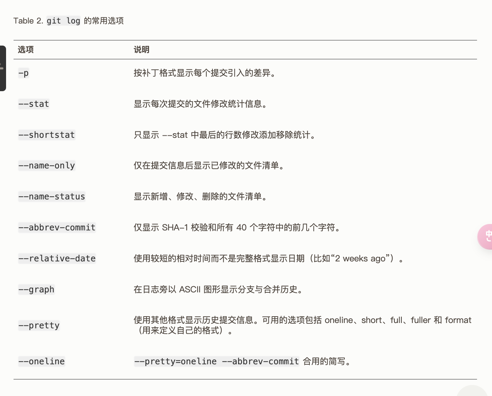
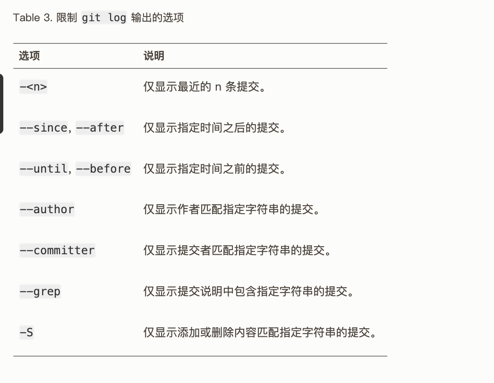

# 2.3 Git 基础 - 查看提交历史

`git log` 会按时间先后顺序列出所有的提交，最近的更新排在最上面。 正如你所看到的，这个命令会列出每个提交的 SHA-1 校验和、作者的名字和电子邮件地址、提交时间以及提交说明。

其中一个比较有用的选项是 `-p` 或 `--patch` ，它会显示每次提交所引入的差异（按 **补丁** 的格式输出）。 你也可以限制显示的日志条目数量，例如使用 `-2` 选项来只显示最近的两次提交

你也可以为 `git log` 附带一系列的总结性选项。 比如你想看到每次提交的简略统计信息，可以使用 `--stat` 选项

另一个非常有用的选项是 `--pretty`。 这个选项可以使用不同于默认格式的方式展示提交历史。 这个选项有一些内建的子选项供你使用。 比如 `oneline` 会将每个提交放在一行显示，在浏览大量的提交时非常有用。 另外还有 `short`，`full` 和 `fuller` 选项，它们展示信息的格式基本一致，但是详尽程度不一：

最有意思的是 `format` ，可以定制记录的显示格式。 这样的输出对后期提取分析格外有用——因为你知道输出的格式不会随着 Git 的更新而发生改变：


你一定奇怪 *作者* 和 *提交者* 之间究竟有何差别， 其实作者指的是实际作出修改的人，提交者指的是最后将此工作成果提交到仓库的人。 所以，当你为某个项目发布补丁，然后某个核心成员将你的补丁并入项目时，你就是作者，而那个核心成员就是提交者。

当 `oneline` 或 `format` 与另一个 `log` 选项 `--graph` 结合使用时尤其有用。



### 限制输出长度

类似 `--since` 和 `--until` 这种按照时间作限制的选项很有用。 例如，下面的命令会列出最近两周的所有提交：

```console
$ git log --since=2.weeks
```

该命令可用的格式十分丰富——可以是类似 `"2008-01-15"` 的具体的某一天，也可以是类似 `"2 years 1 day 3 minutes ago"` 的相对日期。

还可以过滤出匹配指定条件的提交。 用 `--author` 选项显示指定作者的提交，用 `--grep` 选项搜索提交说明中的关键字。

| Note | 你可以指定多个 `--author` 和 `--grep` 搜索条件，这样会只输出匹配 **任意** `--author` 模式和 **任意** `--grep` 模式的提交。然而，如果你添加了 `--all-match` 选项， 则只会输出匹配 **所有** `--grep` 模式的提交。 |
| ---- | ------------------------------------------------------------ |

另一个非常有用的过滤器是 `-S`（俗称“pickaxe”选项，取“用鹤嘴锄在土里捡石头”之意）， 它接受一个字符串参数，并且只会显示那些添加或删除了该字符串的提交。 假设你想找出添加或删除了对某一个特定函数的引用的提交，可以调用：

```console
$ git log -S function_name
```

最后一个很实用的 `git log` 选项是路径（path）， 如果只关心某些文件或者目录的历史提交，可以在 git log 选项的最后指定它们的路径。 因为是放在最后位置上的选项，所以用两个短划线（--）隔开之前的选项和后面限定的路径名。




