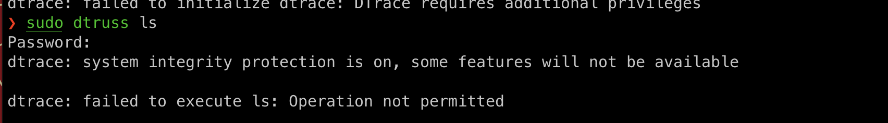

# 7.Debugging and Profiling

# Debugging

## Printf debugging and Logging

* 调试程序的第一种方法是在您发现问题的地方添加打印语句，并不断迭代，直到提取足够的信息来理解问题的原因。

* 第二种方法是在程序中使用日志记录，而不是临时的打印语句。使用日志记录比常规的打印语句更好
  - 您可以将日志记录到文件、套接字甚至远程服务器，而不是标准输出。
  - 日志支持严重级别（如INFO、DEBUG、WARN、ERROR等），允许您相应地过滤输出。
  - 对于新问题，你的日志很有可能包含足够的信息来检测出出了什么问题。

## Third party logs 第三方日志

在系统日志下记录日志，您可以使用 `logger` shell程序。以下是使用 `logger` 的示例以及如何检查该条目是否已记录到系统日志中。此外，大多数编程语言都有将日志绑定到系统日志的功能。

日志可能非常冗长，需要一定程度的处理和过滤才能获取所需的信息。如果你发现自己需要大量过滤 `journalctl` 和 `log show` ，可以考虑使用它们的标志，这些标志可以对输出进行初步过滤。还有一些工具，如 `lnav` ，可以提供改进的日志文件展示和导航功能。

## Debuggers 调试器

调试器是一种允许你与程序的执行进行交互的程序，可以实现以下功能：

- 当程序执行到某一行时停止执行。
- 逐条执行程序的指令。
- 程序崩溃后检查变量的值。
- 当满足给定条件时，有条件地停止执行。
- 还有许多更高级的功能

请注意，由于Python是一种解释型语言，我们可以使用 `pdb` shell来执行命令和执行指令。 `ipdb` 是一个改进的 `pdb` ，它使用 `IPython` REPL，可以实现制表符补全、语法高亮、更好的回溯和更好的内省，同时保留了与 `pdb`模块相同的界面。

对于更低级别的编程，您可能希望研究 `gdb` （以及其质量改进版本 `pwndbg` ）和 `lldb` 。它们针对类似C语言的调试进行了优化，但可以让您探测几乎任何进程并获取其当前的机器状态：寄存器、堆栈、程序计数器等。

## Specialized Tools 专业工具

即使你要调试的是一个黑盒二进制文件，也有工具可以帮助你。每当程序需要执行只有内核才能执行的操作时，它们会使用系统调用。有一些命令可以让你跟踪程序所进行的系统调用。在Linux中有 `strace` ，而macOS和BSD有 `dtrace` 。使用 `dtrace` 可能有些棘手，因为它使用自己的 `D` 语言，但有一个叫做 `dtruss` 的包装器可以提供更类似于 `strace` 的接口（更多详细信息请参见此处）。

**Dtruss**



G

Under some circumstances, you may need to look at the network packets to figure out the issue in your program. Tools like [`tcpdump`](https://www.man7.org/linux/man-pages/man1/tcpdump.1.html) and [Wireshark](https://www.wireshark.org/) are network packet analyzers that let you read the contents of network packets and filter them based on different criteria.
在某些情况下，您可能需要查看网络数据包以找出程序中的问题。像 `tcpdump` 和Wireshark这样的工具是网络数据包分析器，可以让您读取网络数据包的内容并根据不同的条件进行过滤。

对于网页开发来说，Chrome/Firefox开发者工具非常方便。它们包含了许多工具，包括：

- 源代码 - 检查任何网站的HTML/CSS/JS源代码。
- 实时HTML、CSS、JS修改-更改网站内容、样式和行为以进行测试（您可以自己看到网站截图不是有效的证据）。
- JavaScript shell - 在JS REPL中执行命令。
- 网络 - 分析请求时间线。
- 存储 - 查看Cookie和本地应用程序存储。

## Static Analysis 静态分析

对于某些问题，您不需要运行任何代码。例如，仅仅通过仔细查看一段代码，您就可以意识到您的循环变量正在遮蔽一个已经存在的变量或函数名；或者一个程序在定义变量之前就读取了它。这就是静态分析工具发挥作用的地方。静态分析程序将源代码作为输入，并使用编码规则对其进行分析，以推断其正确性。

静态分析工具可以识别这些问题。当我们对代码进行 `pyflakes` 时，会得到与两个错误相关的错误。 `mypy` 是另一个可以检测类型检查问题的工具。在这里， `mypy` 会警告我们 `bar` 最初是一个 `int` ，然后被转换为 `float` 。再次注意，所有这些问题都是在不运行代码的情况下检测到的。

In vim, the plugins [`ale`](https://vimawesome.com/plugin/ale) or [`syntastic`](https://vimawesome.com/plugin/syntastic) will let you do that. For Python, [`pylint`](https://github.com/PyCQA/pylint)and [`pep8`](https://pypi.org/project/pep8/) are examples of stylistic linters and [`bandit`](https://pypi.org/project/bandit/) is a tool designed to find common security issues. For other languages people have compiled comprehensive lists of useful static analysis tools, such as [Awesome Static Analysis](https://github.com/mre/awesome-static-analysis) (you may want to take a look at the *Writing* section) and for linters there is [Awesome Linters](https://github.com/caramelomartins/awesome-linters).
在vim中，插件 `ale` 或 `syntastic` 可以让你做到这一点。对于Python， `pylint` 和 `pep8` 是样式检查工具的示例，而 `bandit` 是一个旨在发现常见安全问题的工具。对于其他语言，人们已经编制了包含有用的静态分析工具的综合列表，例如Awesome Static Analysis（你可能想看一下写作部分），而对于样式检查工具，有Awesome Linters。

与风格检查相辅相成的工具是代码格式化工具，例如Python的 `black` ，Go的 `gofmt` ，Rust的 `rustfmt` 或JavaScript、HTML和CSS的 `prettier` 。这些工具会自动格式化你的代码，使其符合给定编程语言的常见风格模式。尽管你可能不愿意将代码的风格控制权交给他人，但标准化代码格式将帮助其他人阅读你的代码，并使你更擅长阅读其他人（风格上标准化的）代码。

# Profiling

即使您的代码在功能上表现如您所期望的那样，如果它在执行过程中占用了所有的CPU或内存，那可能还不够好。算法课程通常会教授大O符号，但不会教您如何找到程序中的热点。由于过早优化是万恶之源，您应该了解一下性能分析器和监控工具。它们将帮助您了解程序中哪些部分占用了大部分时间和/或资源，以便您可以专注于优化这些部分。

## Timing 时间

直接测量时钟时间可能会误导，因为您的计算机可能同时运行其他进程或等待事件发生。工具通常会区分真实时间、用户时间和系统时间。一般来说，用户时间+系统时间告诉您您的进程实际在CPU上花费了多少时间（更详细的解释请参见此处）。

- 实际时间 - 程序从开始到结束的墙上时钟流逝时间，包括其他进程所花费的时间以及在阻塞状态下所花费的时间（例如等待I/O或网络）。
- 用户 - 在CPU上运行用户代码的时间量
- 系统 - 在CPU中运行内核代码所花费的时间量

```python
#!/usr/bin/env python

import sys, re

def grep(pattern, file):
    with open(file, 'r') as f:
        print(file)
        for i, line in enumerate(f.readlines()):
            pattern = re.compile(pattern)
            match = pattern.search(line)
            if match is not None:
                print("{}: {}".format(i, line), end="")

if __name__ == '__main__':
    times = int(sys.argv[1])
    pattern = sys.argv[2]
    for i in range(times):
        for file in sys.argv[3:]:
            grep(pattern, file)
```


将 compile 提出


Python的 `cProfile` 分析器（以及许多其他分析器）的一个注意事项是它们显示每个函数调用的时间。这可能会变得非常不直观，特别是如果您在代码中使用第三方库，因为内部函数调用也会计算在内。一种更直观的显示分析信息的方法是包括每行代码所花费的时间，这就是行分析器所做的。

If we used Python’s `cProfile` profiler we’d get over 2500 lines of output, and even with sorting it’d be hard to understand where the time is being spent. A quick run with [`line_profiler`](https://github.com/pyutils/line_profiler) shows the time taken per line:
如果我们使用Python的 `cProfile` 分析器，我们会得到超过2500行的输出，即使进行排序，也很难理解时间花在哪里。使用 `line_profiler` 进行快速运行，显示每行所花费的时间：


### Memory 记忆

在像C或C++这样的语言中，内存泄漏可能会导致程序永远不释放不再需要的内存。为了帮助进行内存调试，您可以使用像Valgrind这样的工具来帮助您识别内存泄漏。

In garbage collected languages like Python it is still useful to use a memory profiler because as long as you have pointers to objects in memory they won’t be garbage collected. Here’s an example program and its associated output when running it with [memory-profiler](https://pypi.org/project/memory-profiler/) (note the decorator like in `line-profiler`).
在像Python这样的垃圾回收语言中，使用内存分析器仍然很有用，因为只要您在内存中有对象的指针，它们就不会被垃圾回收。下面是一个示例程序及其在使用内存分析器运行时的相关输出（注意装饰器的使用，类似于 `line-profiler` ）。

### Event Profiling 事件剖析

与调试一样，您可能希望在分析性能时忽略正在运行的代码的具体细节，并将其视为黑盒子。 `strace` 命令将CPU的差异抽象化，并不报告时间或内存，而是报告与您的程序相关的系统事件。例如， `perf` 可以轻松报告缓存局部性差、大量页面错误或活锁。以下是该命令的概述：

- `perf list` - List the events that can be traced with perf
  列出可以使用perf追踪的事件
- `perf stat COMMAND ARG1 ARG2` - Gets counts of different events related to a process or command
  获取与进程或命令相关的不同事件的计数
- `perf record COMMAND ARG1 ARG2` - Records the run of a command and saves the statistical data into a file called `perf.data`
  记录命令的运行并将统计数据保存到一个名为 `perf.data` 的文件中
- `perf report` - Formats and prints the data collected in `perf.data`
  \- 格式化并打印在 `perf.data` 中收集的数据

### Visualization 可视化

真实世界程序的分析器输出将包含大量信息，因为软件项目本身的复杂性。人类是视觉动物，在阅读大量数字并理解它们方面非常糟糕。因此，有许多工具可以以更易于解析的方式显示分析器的输出。

One common way to display CPU profiling information for sampling profilers is to use a [Flame Graph](http://www.brendangregg.com/flamegraphs.html), which will display a hierarchy of function calls across the Y axis and time taken proportional to the X axis. They are also interactive, letting you zoom into specific parts of the program and get their stack traces (try clicking in the image below).
一种常见的显示采样分析器的CPU分析信息的方法是使用火焰图，它会在Y轴上显示函数调用的层次结构，而在X轴上显示所花费的时间比例。它们还具有交互功能，可以让您放大程序的特定部分并获取它们的堆栈跟踪（请尝试在下面的图像中点击）。

调用图或控制流图通过将函数作为节点，函数之间的调用作为有向边来显示程序中子程序之间的关系。当与调用次数和所花时间等分析信息结合使用时，调用图对于解释程序的流程非常有用。在Python中，您可以使用 `pycallgraph` 库来生成它们。

[`pycallgraph`](https://pycallgraph.readthedocs.io/)

## Resource Monitoring 资源监控

有时，分析程序性能的第一步是了解其实际的资源消耗情况。当程序受到资源限制时，例如内存不足或网络连接缓慢，程序通常运行缓慢。有许多命令行工具可以探测和显示不同的系统资源，如CPU使用率、内存使用率、网络、磁盘使用率等等。

常规监控 - 可能最受欢迎的是 `htop` ，它是 `top` 的改进版本。 `htop` 显示系统上当前运行进程的各种统计信息。 `htop` 有很多选项和键绑定，其中一些有用的是：使用 `<F6>` 对进程进行排序，使用 `t` 显示树形层次结构，使用 `h` 切换线程。另请参阅 `glances` ，它具有出色的用户界面类似的实现。要获取所有进程的聚合度量， `dstat` 是另一个方便的工具，它计算各种不同子系统（如I/O、网络、CPU利用率、上下文切换等）的实时资源指标。

- **I/O operations** - [`iotop`](https://www.man7.org/linux/man-pages/man8/iotop.8.html) displays live I/O usage information and is handy to check if a process is doing heavy I/O disk operations
  I/O操作 - `iotop` 显示实时的I/O使用信息，方便检查进程是否正在进行大量的I/O磁盘操作

- **Disk Usage** - [`df`](https://www.man7.org/linux/man-pages/man1/df.1.html) displays metrics per partitions and [`du`](http://man7.org/linux/man-pages/man1/du.1.html) displays **d**isk **u**sage per file for the current directory. In these tools the `-h` flag tells the program to print with **h**uman readable format. A more interactive version of `du` is [`ncdu`](https://dev.yorhel.nl/ncdu) which lets you navigate folders and delete files and folders as you navigate.
  磁盘使用情况 - `df` 显示每个分区的指标， `du` 显示当前目录下每个文件的磁盘使用情况。在这些工具中， `-h` 标志告诉程序以人类可读的格式打印。一个更交互式的版本是 `du` ，它允许您在浏览文件夹时删除文件和文件夹。

- **Memory Usage** - [`free`](https://www.man7.org/linux/man-pages/man1/free.1.html) displays the total amount of free and used memory in the system. Memory is also displayed in tools like `htop`.
  内存使用情况 - `free` 显示系统中可用和已使用的总内存量。内存也显示在 `htop` 等工具中。
- **Memory Usage** - [`free`](https://www.man7.org/linux/man-pages/man1/free.1.html) displays the total amount of free and used memory in the system. Memory is also displayed in tools like `htop`.
  内存使用情况 - `free` 显示系统中可用和已使用的总内存量。内存也显示在 `htop` 等工具中。
- **Open Files** - [`lsof`](https://www.man7.org/linux/man-pages/man8/lsof.8.html) lists file information about files opened by processes. It can be quite useful for checking which process has opened a specific file.
  打开的文件 - `lsof` 列出了进程打开的文件的信息。对于检查哪个进程打开了特定文件非常有用。
- **Network Connections and Config** - [`ss`](https://www.man7.org/linux/man-pages/man8/ss.8.html) lets you monitor incoming and outgoing network packets statistics as well as interface statistics. A common use case of `ss` is figuring out what process is using a given port in a machine. For displaying routing, network devices and interfaces you can use [`ip`](http://man7.org/linux/man-pages/man8/ip.8.html). Note that `netstat` and `ifconfig` have been deprecated in favor of the former tools respectively.
  网络连接和配置 - `ss` 允许您监视传入和传出的网络数据包统计信息以及接口统计信息。 `ss` 的常见用例是找出在计算机上使用给定端口的进程。要显示路由、网络设备和接口，您可以使用 `ip` 。请注意， `netstat` 和 `ifconfig` 已被分别弃用，取而代之的是前者工具。

### Specialized tools 专业工具

有时候，黑盒基准测试就足以确定使用哪个软件。像 `hyperfine` 这样的工具可以让你快速对命令行程序进行基准测试。例如，在shell工具和脚本讲座中，我们推荐使用 `fd` 而不是 `find` 。我们可以使用 `hyperfine` 来比较它们在我们经常运行的任务中的表现。例如，在下面的示例中， `fd` 在我的机器上比 `find` 快了20倍。

与调试一样，浏览器还配备了一套出色的工具，用于分析网页加载，让您了解时间花在哪里（加载、渲染、脚本等）。有关Firefox和Chrome的更多信息。

