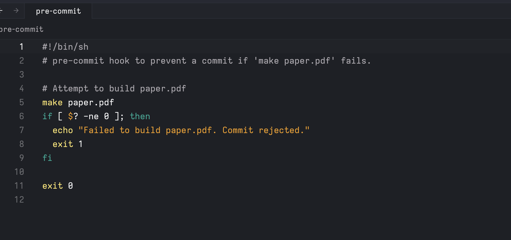

# Exercises 练习

1. Most makefiles provide a target called `clean`. This isn’t intended to produce a file called `clean`, but instead to clean up any files that can be re-built by make. Think of it as a way to “undo” all of the build steps. Implement a `clean` target for the `paper.pdf` `Makefile` above. You will have to make the target [phony](https://www.gnu.org/software/make/manual/html_node/Phony-Targets.html). You may find the [`git ls-files`](https://git-scm.com/docs/git-ls-files) subcommand useful. A number of other very common make targets are listed [here](https://www.gnu.org/software/make/manual/html_node/Standard-Targets.html#Standard-Targets).
   大多数makefile提供了一个名为 `clean` 的目标。这并不意味着要生成一个名为 `clean` 的文件，而是清理可以由make重新构建的任何文件。将其视为“撤销”所有构建步骤的方法。为上述 `paper.pdf` `Makefile` 实现一个 `clean` 目标。您将需要将目标设置为虚拟目标。您可能会发现 `git ls-files` 子命令很有用。这里列出了一些其他非常常见的make目标。

1. Take a look at the various ways to specify version requirements for dependencies in [Rust’s build system](https://doc.rust-lang.org/cargo/reference/specifying-dependencies.html). Most package repositories support similar syntax. For each one (caret, tilde, wildcard, comparison, and multiple), try to come up with a use-case in which that particular kind of requirement makes sense.
   看一下在Rust的构建系统中指定依赖版本要求的各种方式。大多数软件包仓库都支持类似的语法。对于每种方式（插入符、波浪线、通配符、比较和多个），尝试想出一个合理的使用案例。

# [Specifying Dependencies 指定依赖关系](https://doc.rust-lang.org/cargo/reference/specifying-dependencies.html#specifying-dependencies)

1. Git can act as a simple CI system all by itself. In `.git/hooks` inside any git repository, you will find (currently inactive) files that are run as scripts when a particular action happens. Write a [`pre-commit`](https://git-scm.com/docs/githooks#_pre_commit) hook that runs `make paper.pdf` and refuses the commit if the `make` command fails. This should prevent any commit from having an unbuildable version of the paper.
   Git可以作为一个简单的CI系统。在任何git仓库中，你会找到（目前不活动的）文件，当特定的操作发生时，它们会作为脚本运行。编写一个钩子，运行 `make paper.pdf` 并在 `make` 命令失败时拒绝提交。这样可以防止提交一个无法构建的版本的文件。

1. Set up a simple auto-published page using [GitHub Pages](https://pages.github.com/). Add a [GitHub Action](https://github.com/features/actions) to the repository to run `shellcheck` on any shell files in that repository (here is [one way to do it](https://github.com/marketplace/actions/shellcheck)). Check that it works!
   使用GitHub Pages设置一个简单的自动发布页面。向存储库添加一个GitHub Action，以在该存储库中的任何shell文件上运行 `shellcheck` （这是一种方法）。检查它是否正常工作！

1. [Build your own](https://help.github.com/en/actions/automating-your-workflow-with-github-actions/building-actions) GitHub action to run [`proselint`](https://github.com/amperser/proselint) or [`write-good`](https://github.com/btford/write-good) on all the `.md` files in the repository. Enable it in your repository, and check that it works by filing a pull request with a typo in it.
   在存储库中构建自己的GitHub操作，以在所有 `.md` 文件上运行 `proselint` 或 `write-good` 。在存储库中启用它，并通过提交一个存在拼写错误的拉取请求来检查它是否正常工作。