# SystemDesgin notes

From https://github.com/Admol/SystemDesign

**使用什么数据库？**

你可以在传统关系型数据库和非关系型数据库之间进行选择。让我们来看看它们的区别。

关系型数据库也称为关系数据库管理系统（RDBMS）或SQL数据库。其中最流行的包括MySQL、Oracle数据库、PostgreSQL等。关系型数据库使用表格和行来表示和存储数据。你可以使用SQL在不同的数据库表之间执行连接操作。

非关系型数据库也称为NoSQL数据库。其中一些流行的包括CouchDB、Neo4j、Cassandra、HBase、Amazon DynamoDB等\[2]。这些数据库分为四类：键值存储、图存储、列存储和文档存储。非关系型数据库通常不支持连接操作。

对于大多数开发者来说，关系型数据库是最佳选择，因为它们已经存在了40多年，历史上一直表现良好。然而，如果关系型数据库不适用于你特定的用例，那么探索超越关系型数据库是至关重要的。

在以下情况，非关系型数据库可能是正确的选择：

* 你的应用程序需要超低延迟
* 你的数据是非结构化的，或者你没有任何关系型数据。
* 你只需要序列化和反序列化数据（JSON、XML、YAML等）。
* 你需要存储大量的数据

#### 垂直扩展vs水平扩展

垂直扩展，又称为“纵向扩展”，指的是通过增加单个服务器的计算能力（CPU、RAM等）来提升其性能。

水平扩展，又称为“横向扩展”，允许通过向资源池中添加更多服务器来进行扩展。

当流量较低时，垂直扩展是一个很好的选择，而垂直扩展的主要优势在于其简单性。不幸的是，它也带有一些严重的限制。

* 垂直扩展有一个硬性限制，不可能为单个服务器无限制的添加CPU和内存
* 垂直扩展没有故障转移和冗余，如果一台服务出现宕机，网站和应用程序都会彻底宕机。

由于垂直扩展的局限性，对于大规模应用程序来说，水平扩展更为理想。

在以前的设计中，用户直接连接到web服务器，如果服务器下线，用户将不能访问网站。在另一种情况下，如果许多用户同时访问web服务器，并且它达到了web服务器的限制，则用户通常会遇到响应较慢或者无法连接到服务器的情况。

负载均衡是解决这些问题的最佳技术方案。

### 数据库复制

引用自维基百科：“数据库复制可适用于许多数据库管理系统，通常在原始数据库(master)与副本数据库(slaves)之间建立主/从关系”。

主数据库通常仅支持写的操作。从数据库从主数据库中复制数据并且仅支持读操作。所有修改数据的命令，如：insert，delete，update 都必须发送到主数据库。

大多数应用程序对读写比的要求较高，因此，系统中从库的数量通常大于主库的数量。

数据库复制的优势包括：

* 更好的性能：在这个主/从模型中，所有的写入和更新都发生在主节点，而所有的读操作分布在从节点。这种模型提高了性能，因为它允许并行处理更多的查询。
* 可靠性：如果你的其中一台数据库被台风、地震等自然灾害破坏，数据仍然会被保留。你无需担心数据丢失，因为数据被复制到多个位置。
* 高可用性：通过在不同位置复制数据，即使一台数据库离线，你的网站仍然可以运行，因为你可以访问存储在另一个数据库服务器中的数据。

在前面的部分，我们讨论了负载均衡器如何帮助提高系统的可用性。在这里我们提出相同的问题：如果其中一个数据库离线怎么办？图1-5中讨论的架构设计可以处理这种情况：

* 如果只有一个从数据库可用且它离线，读操作将临时指向主数据库。一旦发现问题，一个新的从库将会替换掉旧的从库，如果有多个从数据库是可用的，读操作会被转发到其他健康的从数据库，
* 如果主数据库离线，一个从库会被提升为新的主库，所有的数据库操作都会临时在新的主库上执行。一个新的从库将会立即替换旧的从库进行数据复制。在生产系统中，提升一个新的主数据库更为复杂，因为从库中的数据可能不是最新的，丢失的数据需要通过运行数据恢复脚本来更新。尽管一些其他的复制方法，如多主复制和循环复制，可能有所帮助，但他们的配置更加复杂；这些讨论将超出本书的讨论范围，有兴趣的读者可以参考列出的参考资料\[4]\[5]。

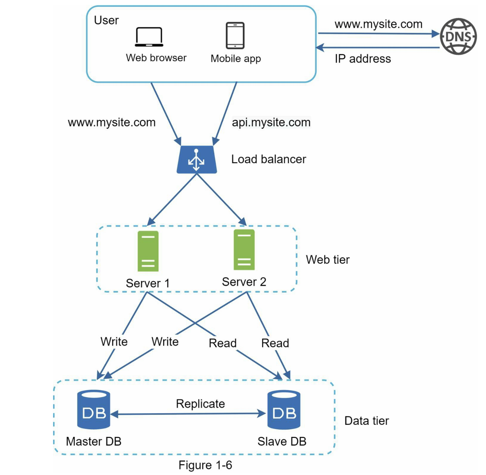

### 缓存

缓存是一个临时存储区域，用于将昂贵的响应结果或频繁的访问数据存储在内存中，以便之后的请求能被更快的处理。如图1-6所示，每当加载新的网页时，会执行一个或多个数据库调用来获取数据。通过重复调用数据库，应用程序的性能会受到很大影响。缓存可以缓解这个问题。

#### 缓存层

缓存层是一个临时的数据存储层，比数据库更快。拥有独立的缓存层的好处包括更好的系统性能、减轻数据库负载的能力以及能够独立扩展缓存层。图1-7展示了一个可能的缓存服务器设置：

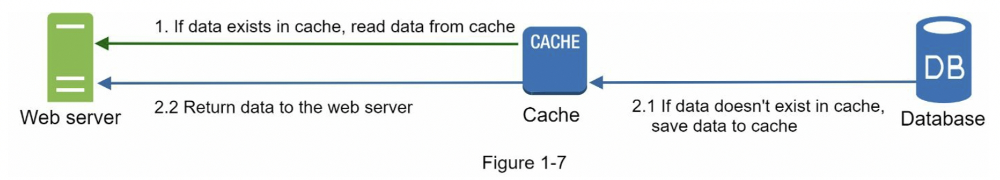

在接收到请求后，Web服务器首先检查缓存是否有可用的响应。如果有，它将数据发送回客户端。如果没有，它会查询数据库，保存响应结果到缓存中，并将其发送回客户端。这种缓存策略称为读取穿透缓存。根据数据类型、大小和访问模式，还有其他可用的缓存策略。之前的一项研究解释了不同缓存策略的工作原理\[6]。

与缓存服务器的交互很简单，因为大多数缓存服务器提供了常见编程语言的API。

#### 使用缓存的注意事项

这里有一些使用缓存系统的注意事项：

* 决定何时使用缓存：当数据频繁读取但不经常修改时，请考虑使用缓存。由于缓存数据存储在易失的内存中，所以缓存服务器不适合持久化数据。例如，如果缓存服务器重启了，内存中所有的数据都会丢失，因此，重要的数据应该保存在持久数据存储中。
* 过期策略：实施过期策略是个好习惯，一旦缓存数据过期，它就会从缓存中删除。当没有过期策略时，缓存数据将被永久的保存在内存中。建议不要将过期时间设置的太短，因为这会导致系统过于频繁地从数据库重新加载数据。于此同时，建议不要将过期时间设置的太长，因为数据可能会过时。
* 一致性：这涉及保持数据存储和缓存同步。一致性可能会发生，因为对数据存储和缓存的修改操作不在一个事务中。在跨多个区域扩展时，保持数据存储和缓存之间的一致性具有挑战性。有关更多信息，请参阅Facebook发布的“Scaling Memcache at Facebook”论文\[7]。
* 减少故障：单个缓存服务器代表了潜在的单点故障（SPOF），在维基百科中定义如下：“单点故障（SPOF）是系统的一部分，如果它发生故障，将使整个系统停止工作。”\[8]。因此，建议在不同数据中心使用多个缓存服务器，以避免单点故障(SPOF)。另一种推荐的方法是通过配置比所需的大小还多一定百分比的内存。这在内存使用量上升的时候起到一个缓冲的效果。
* 驱逐策略：一旦缓存满了，任何尝试向缓存中添加内容的请求都可能导致现有项被移除，这称为缓存驱逐。最近最少使用（LRU）是最流行的缓存驱逐策略。可以使用其他逐出策略，例如：最不常用（LFU）或先进先出（FIFO），以满足不同的使用场景。

### CDN

CDN（内容分发网络）是一个由地理上分散的服务器组成的网络，用于提供静态内容。CDN服务器缓存静态内容，如：图片、视频、CSS、JavaScript文件等。

动态内容缓存是一个相对较新的概念，超出了本书的范围。它支持缓存基于请求路径、查询字符串、Cookie和请求头缓存HTML页面。有关更多信息，请参阅参考资料\[9]中提到的文章，本书重点介绍如何使用CDN缓存静态内容。

在高层次上，CDN的工作原理如下：当用户访问一个网站时，距离用户最近的CDN服务器将提供静态内容。直观的说，用户距离CDN服务器越远，网站加载速度就越慢。例如，如果CDN服务器位于旧金山，那么洛杉矶的用户将比欧洲的用户更快的获取内容。图1-9是一个很好的例子，展示了CDN如何缩减加载时间。

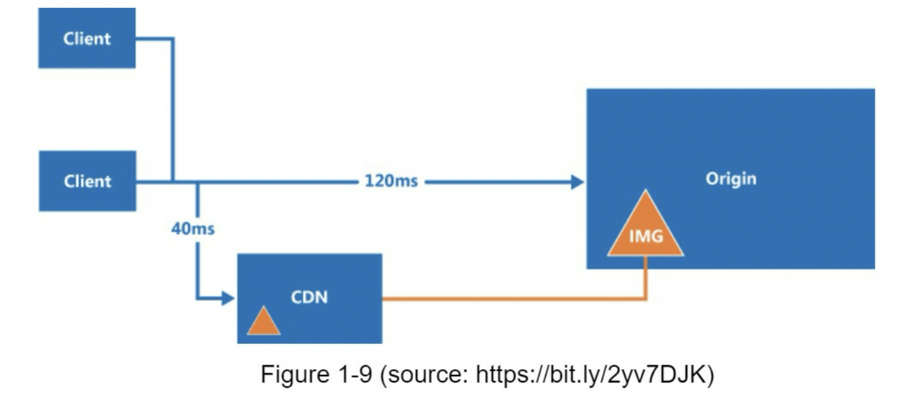

图1-10演示了CDN工作流程

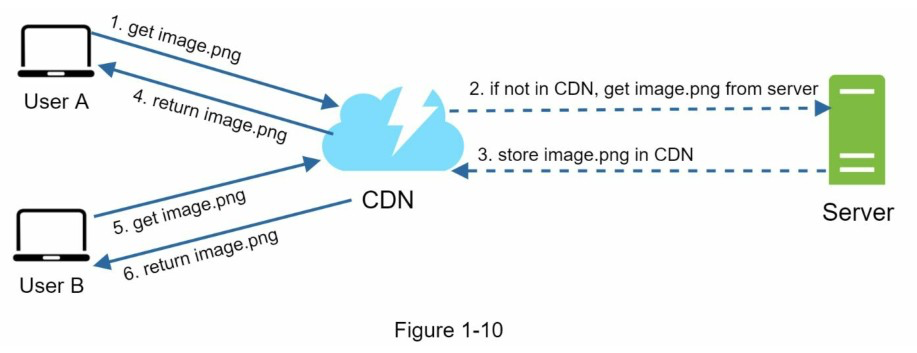

添加CDN和缓存后的设计如图1-11 所示

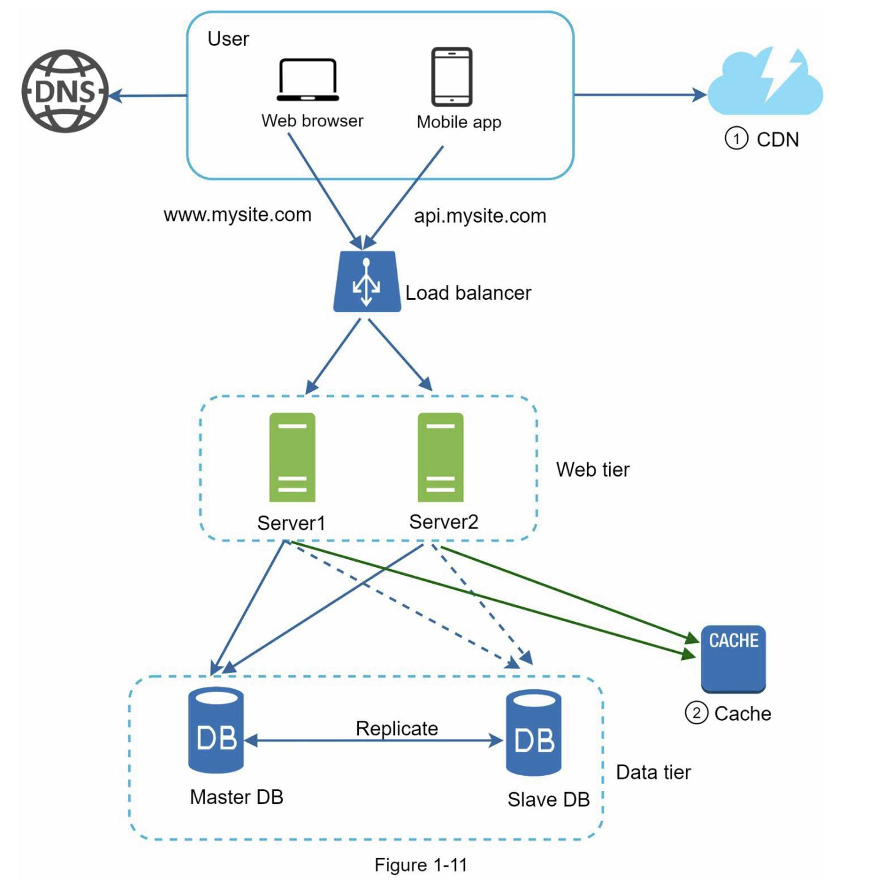

1. Web服务器不再提供静态资产(JS、CSS、图像等)，它们从CDN获取以获得更好的性能。
2. 通过缓存数据，减轻了数据库的负载。

### 无状态的Web层

现在是时候考虑水平扩展Web层了，为此，我们需要将状态(例如用户会话数据)移出Web层。一个好的做法是将会话数据存储在持久性存储中，比如关系型数据库或NoSQL。集群中的每个Web服务器都可以从数据库中访问状态数据，这被称为无状态的Web层。

#### 有状态架构

有状态服务和无状态服务有一些关键区别。有状态服务器会在一个请求到下一个请求时记住客户端数据(状态)。无状态服务不会保留任何状态信息。

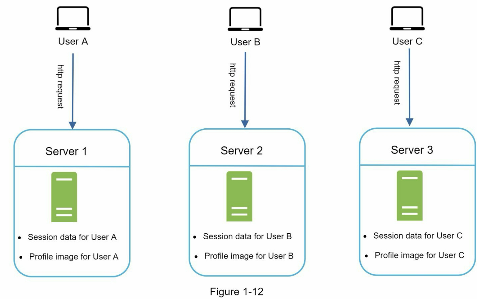

在图1-12 中，用户A的会话数据和头像数据存储在Server 1中，要对用户A进行身份验证，必须将HTTP请求路由到Server 1，如果将请求发送到其他服务器，比如Server，身份验证将失败，因为Server 2不包含用户A的会话数据。同样，用户B的所有Http请求都必须路由到Server 2，所有来自用户C的请求必须发送到Server 3。

问题在于，来自同一客户端的每个请求必须路由到同一台服务器。在大多数负载均衡器中，可以使用粘性会话（sticky sessions）来实现这一点\[10]；然而，这会增加开销，使用这种方法更难添加或删除服务器，处理服务器故障也是一个挑战。

#### 无状态的架构

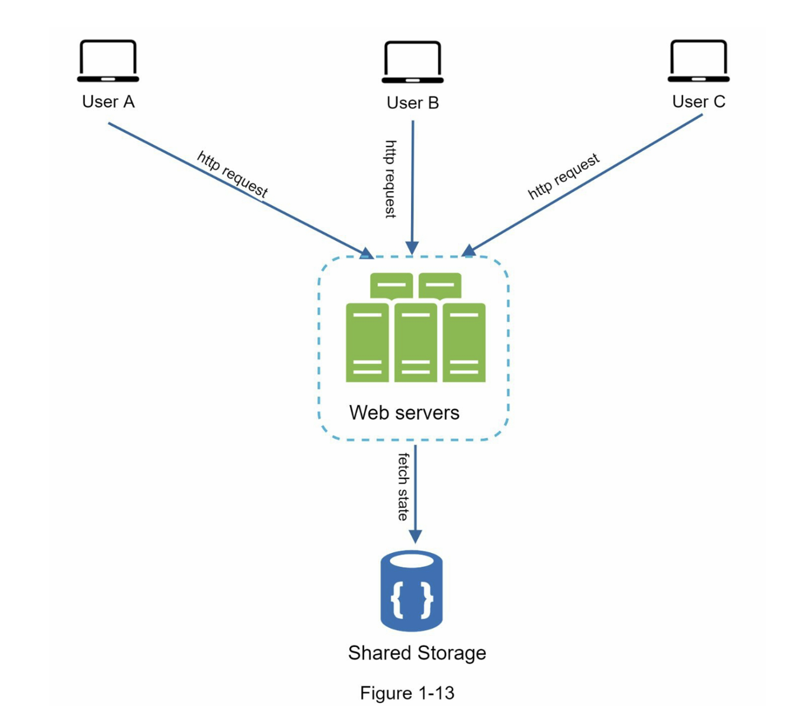

来自用户的HTTP请求可以被发送到任何Web服务器，并从共享的数据存储中获取状态数据。状态数据存储在共享的数据存储中，并且不存储在Web服务器中，一个无状态的系统更简单、更健壮且可扩展。

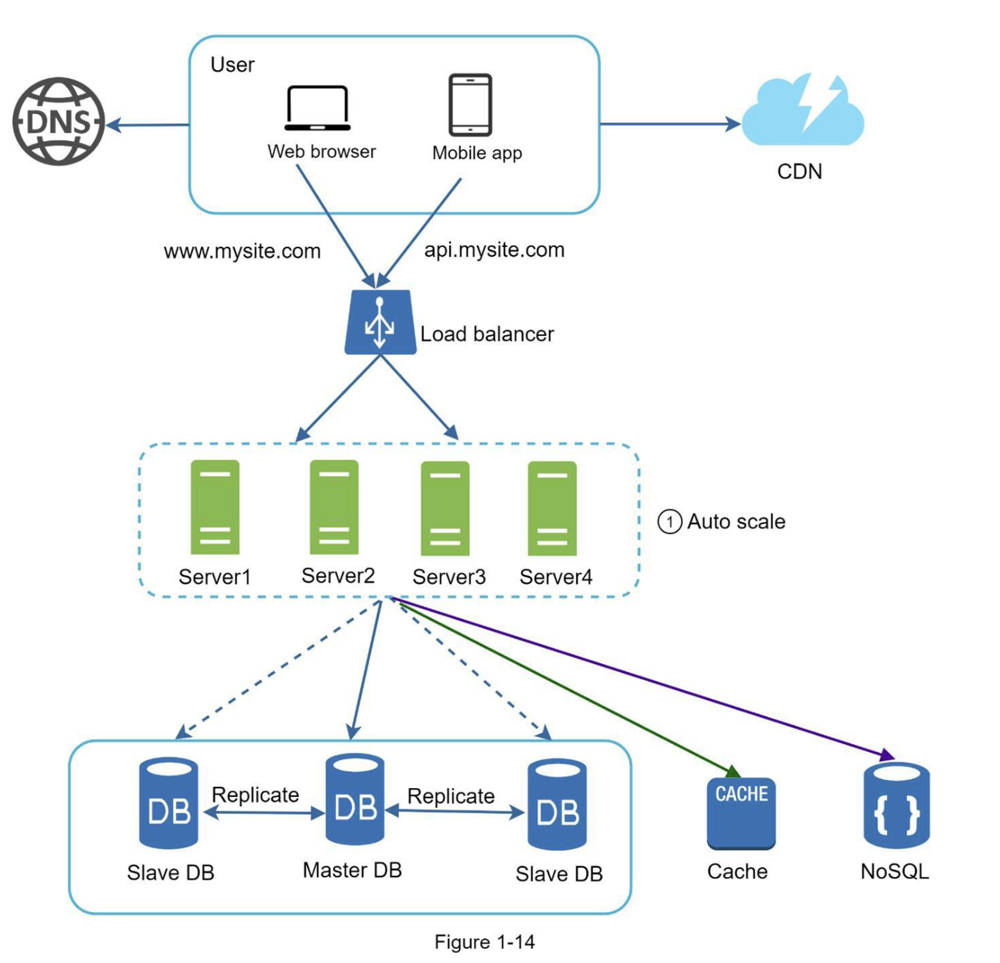

### 数据中心

图1-15显示了具有两个数据中心的示例设置。在正常运行时，用户通过geoDNS路由(也称为地理路由)到最近的数据中心，美国东部的流量为x%，美国西部的流量为(100-x)%。geoDNS是一种DNS服务，允许根据用户的位置将域名解析为IP地址。

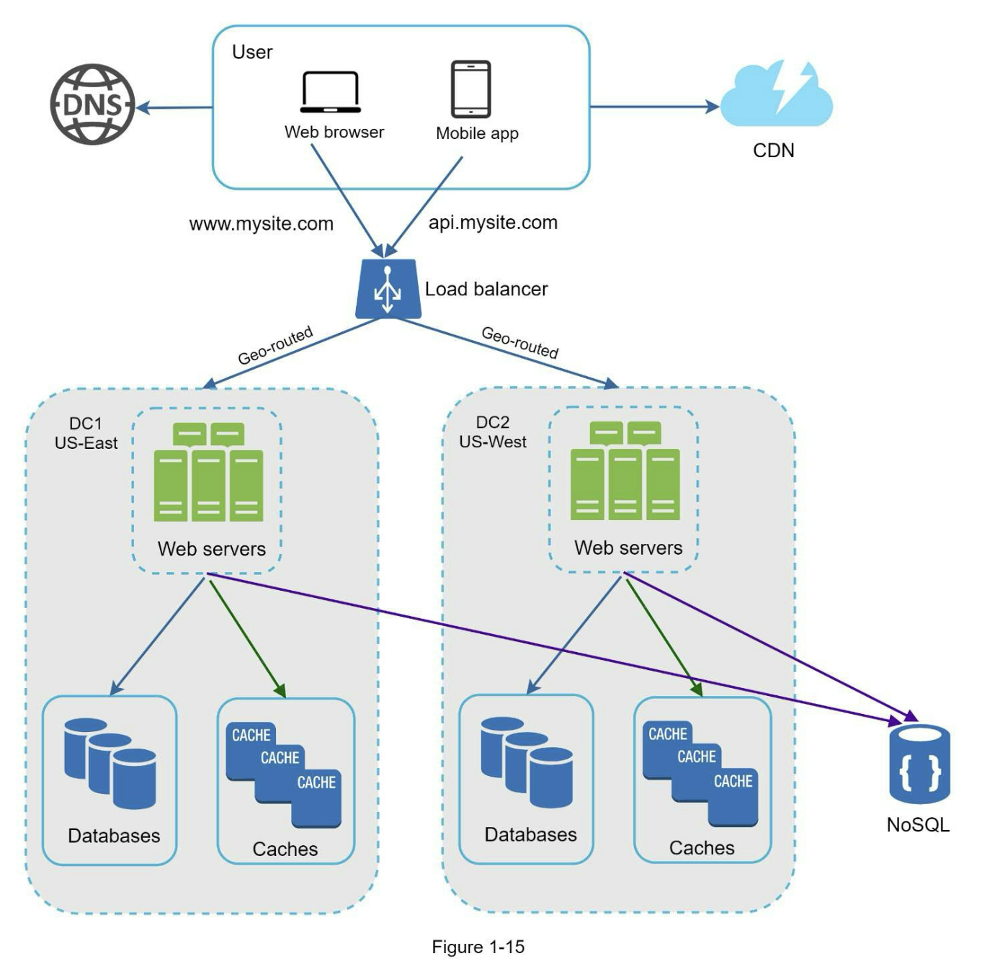

在发生任何重大数据中心中断的情况下，我们将所有流量引导到一个健康的数据中心。图1-16中，数据中心2(美西)处于离线状态，100%的流量路由到数据中心1(美东) 

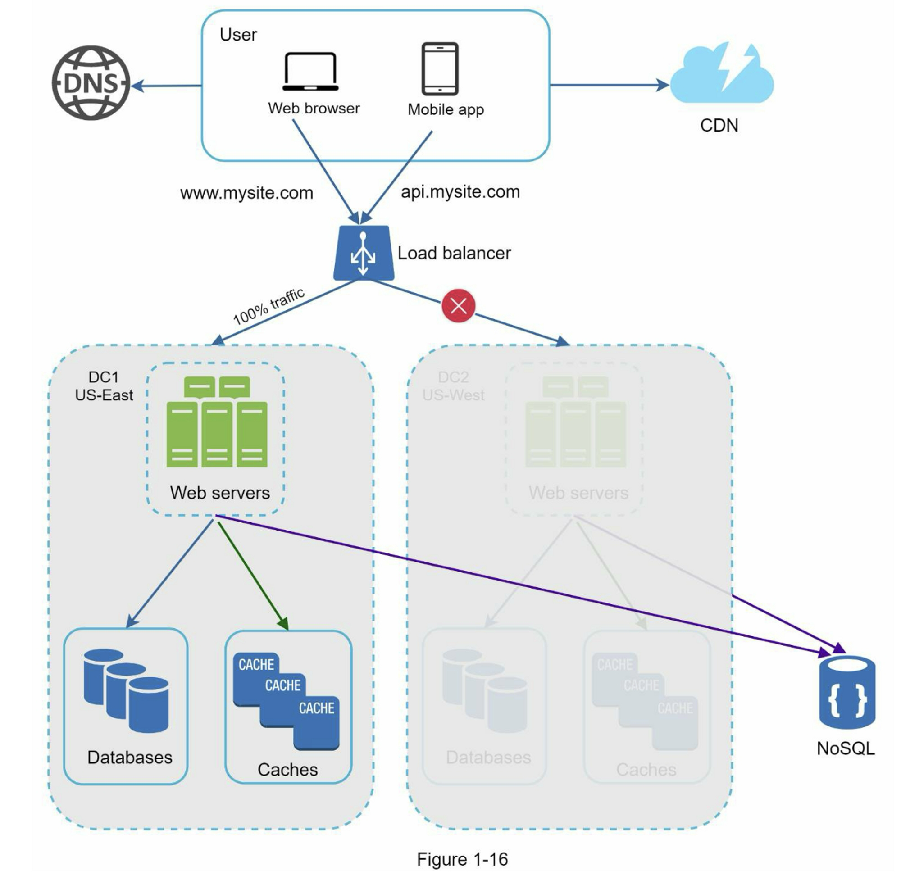

要实现多数据中心配置，必须要解决几个技术难题：

* 流量重定向：需要有效的工具将流量重定向到正确的数据中心。geoDNS可以根据用户位置将流量引导至用户最近的数据中心。

* 数据同步：来自不同地区的用户可以使用不同的本地数据库或缓存，在故障转移的情况下，流量可能被路由到不可用的数据中心。一种常见的策略是跨多个数据中心复制数据。之前的研究展示了Netflix如何实现异步多数据中心复制\[11]

* 测试和部署：对于多数据中心设置，在不同位置测试网站/应用程序非常重要，自动化部署工具对于保持所有数据中心的服务一致性至关重要 \[11]。

  为了更进一步扩展我们的系统，我们需要解耦系统的不同组件，使它们可以独立扩展。消息队列是许多实际分布式系统采用的关键策略，用于解决这个问题。

### 消息队列

消息队列说一个持久的组件，存储在内存中，支持异步通信，它充当缓冲区并分发异步请求。消息队列的基础架构非常简单，输入服务，被称为生产者/发布者，创建消息，并将它们发送到消息队列中。其他服务或服务器，称为消费者/订阅者，连接到队列，并执行消息定义的动作。

### 日志记录、指标、自动化

当处理运行在少量服务器上的小型网站时，日志记录、指标、和自动化支持是很好的选择，但并不是必须的。但是，现在你的网站已经发展成为一个大型业务，那么投资这些工具是必不可少的。

日志记录：监控错误日志是重要的，因为它有助于识别系统中的错误和问题。您可以在每个服务器级别监视错误日志，或使用工具将它们汇总到一个集中的服务中，以便于搜索和查看。

指标：收集不同类型的指标有助于我们获得业务洞察能力和了解系统的健康状态。以下一些指标是有用的：

* 主机级别的指标：CPU、内存、磁盘I/O等
* 聚合级别的指标：例如，整个数据库层、缓存层的性能
* 关键业务指标：每日活跃用户、留存数、收入等

自动化：当系统变得庞大而复杂时，我们需要构建或利用自动化工具来提高生产力。持续集成是一种很好的做法，其中每次代码提交都通过自动化进行验证，使团队能够及时发现问题。此外，将你的构建、测试、部署过程等自动化，可以显著提高开发人员的生产力。

#### 添加消息队列和不同的工具

图1-19展示了更新后的设计，限于篇幅有限，图中仅显示了一个数据中心。

1. 该设计包含一个消息队列，有助于使系统更松耦合和故障恢复能力。
2. 日志记录、监控、指标、自动化工具也包括其中。 

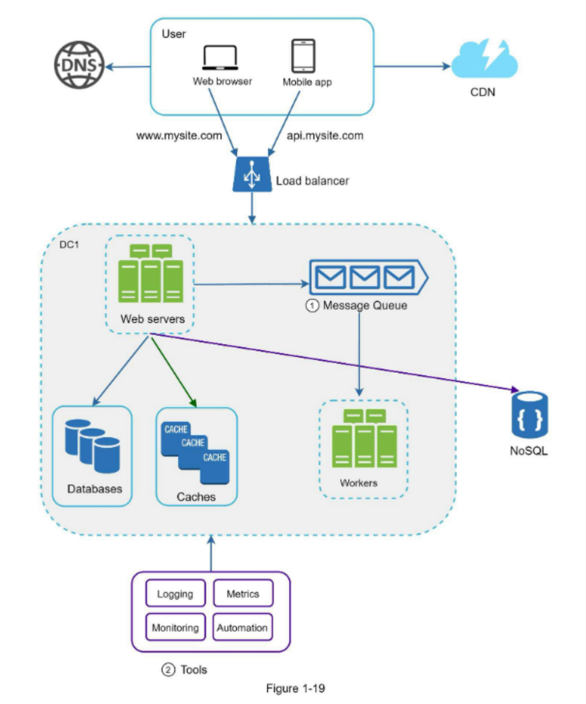

### 数据库扩展

这里有两种广泛的数据库扩展方法：垂直扩展和水平扩展

#### 垂直扩展

垂直扩展，也被称为向上扩展，是通过向现有机器添加更多资源（如CPU、内存、磁盘等）来进行扩展的。

有一些强大的数据库服务器。根据亚马逊关系数据库服务（RDS）\[12]，你可以得到一个 24TB 内存的数据库服务器。这种强大的数据库服务器可以存储和处理大量的数据。例如，stackoverflow.com在2013年有超过1000万的每月独立访客，但它只有1个主数据库\[13]。

然而，垂直扩展也有一些严重的缺点：

* 你可以向你的服务器中添加更多的CPU、内存等，但是是有硬件限制的。如果你有一个庞大的用户群，一台服务是不够的。
* 单点故障的风险更大
* 垂直扩展的总体成本更高，强大的服务器要贵得多。

#### 水平扩展

水平扩展，也称为分片，是添加更多服务器的做法。图1-20比较了垂直扩展和水平扩展。

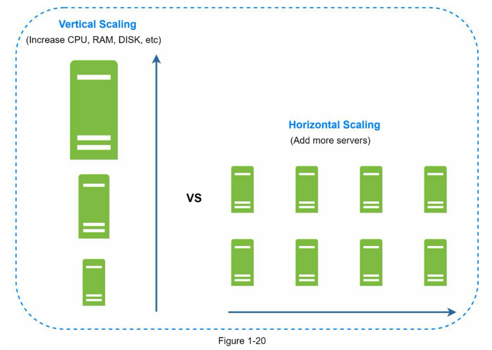

分片是扩展数据库的一项伟大技术，但它远不是一个完美的解决方案。它为系统引入了复杂性和新的挑战：

* 重新分片数据：在以下情况，需要从新分片数据。
  1. 由于快速增长，单个分片无法再容纳更多数据
  2. 由于数据分布不均匀，某些分片可能比其他分片更快被耗尽，当分片耗尽时，需要更新分片功能并移动数据。一致性哈希，将在第5章中讨论，是解决此问题的常用技术。
* 名人问题：这也被称为热点键问题。对一个特定分片的过度访问可能会导致服务器过载。想象一下 Katy Perry、Justin Bieber 和 Lady Gaga 的数据最终都在同一个分片上，对于社交应用来说，这个分片将会被读操作淹没。为了解决这个问题，我们可能需要为每一个名人分配一个分片，每个分片甚至可能需要进一步分区。
* 连接和去范式化：一旦数据库跨多个服务分片，就很难跨数据库分片执行连接操作。常见的解决方法是对数据库进行去范式化，以便可以在单个表中执行查询。

### 百万用户及以上

扩展系统是一个持续迭代的过程。重复我们在本章中学到的知识可以使我们走的更远。为了超越百万用户，需要更多的微调和新的策略。例如，你可能需要优化你的系统，将系统解耦为更小的服务。本章所学的知识为应对新的挑战提供了一个良好的应对基础。在本章最后，我们提供了一个关于我们如何扩展我们系统以支持数百万用户的总结：

* 保持Web层无状态
* 在每一层建立冗余
* 尽可能缓存数据
* 支持多个数据中心
* 在CDN中托管静态数据
* 通过分片扩展数据层
* 将层拆分为单独的服务
* 监控你的系统并使用自动化工具

祝贺您走到这一步！现在给自己一个鼓励，干得漂亮！
