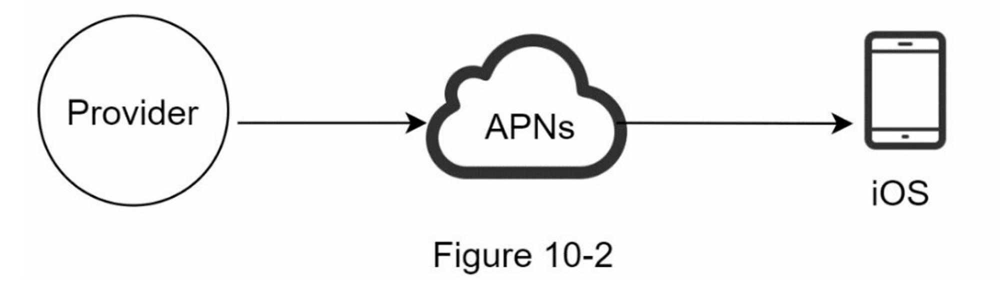
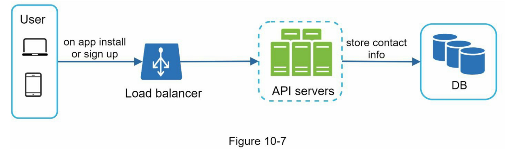
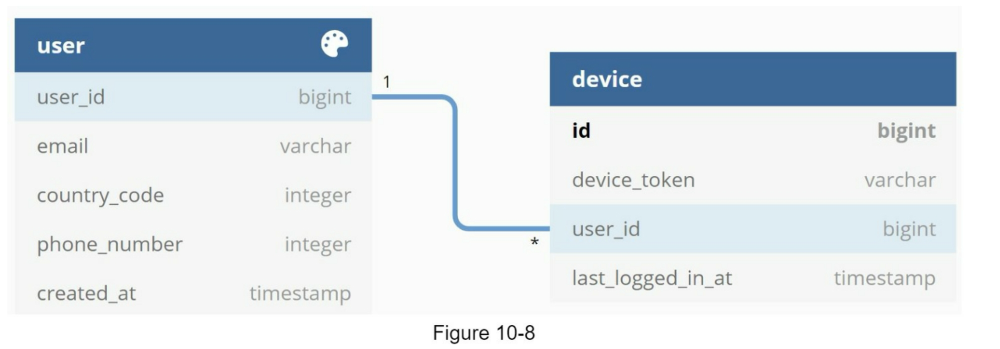
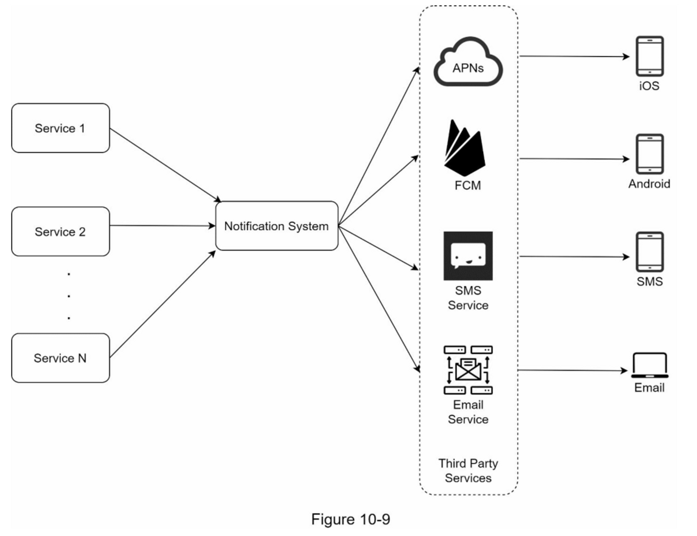
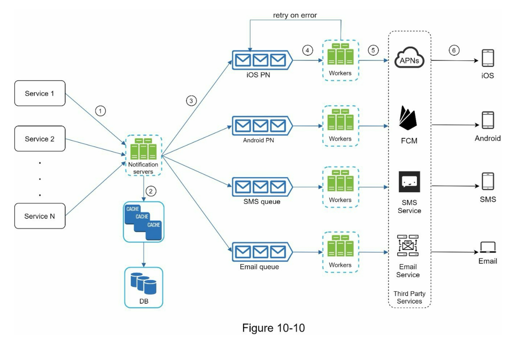

第10章：设计一个通知系统

### 提出高层次的设计方案并获得认同

本节展示了支持各种通知类型的高层设计：iOS推送通知、Android推送通知、短信和电子邮件。它的结构如下：

* 不同的通知类型
* 联系人信息收集流程
* 通知发送/接收流程

#### 不同的通知类型

我们先看一下每种通知类型在高层次上是如何工作的。



我们主要需要三个组件来发送 iOS 推送通知：

1. Provider（提供商）：提供商构建通知请求并将其发送到 Apple 推送通知服务 (APNS)。 要构建推送通知，提供者提供以下数据：

   1. 设备 token：这是用于发送推送通知的唯一标识符。

   2. 有效载荷：是一个包含通知有效载荷的 JSON 字典。 例子：

      ```json
      {
          "aps": {
              "alert": {
                  "title": "Game Request",
                  "body": "Bob wants to play chess",
                  "action-loc-key": "PLAY"
              },
              "badge": 5
          }
      }
      ```

2. 苹果推送通知服务（APNS）： 这是 Apple 提供的远程服务，用于将推送通知传播到 iOS 设备。

3. iOS 设备：它是接收推送通知的终端客户端。

#### 联系人信息收集流程

要发送通知，我们需要收集移动设备令牌、电话号码或电子邮件地址。 如图 10-7 所示，当用户安装我们的应用程序或首次注册时，API 服务器会收集用户联系信息并将其存储在数据库中。





#### 通知发送/接收流程

我们将首先介绍初始设计；然后，提出了一些优化方案。

**高层设计**



**服务1到N**：一个服务可以是一个微服务，一个cron job，或者一个触发通知发送事件的分布式系统。例如，一个计费服务发送电子邮件提醒客户到期付款，或者一个购物网站通过短信告诉客户他们的包裹明天会被送到。

**通知系统**：通知系统是发送/接收通知的中心环节。从简单的东西开始，只使用一个通知服务器。它为服务1到N提供API，并为第三方服务建立通知有效载荷。

**第三方服务**：第三方服务负责向用户发送通知。在与第三方服务集成时，我们需要特别注意可扩展性。良好的可扩展性意味着一个灵活的系统可以很容易地插入或拔出第三方服务。另一个重要的考虑因素是，第三方服务可能在新的市场或在未来无法使用。例如，FCM在中国是不可用的。因此，在那里使用替代的第三方服务，如Jpush、PushY等。

**iOS, Android, SMS, Email**：用户在其设备上收到通知。

在这个设计中，发现了三个问题：

1. 单点故障（SPOF）：单一通知服务器意味着SPOF。
2. 难以扩展：通知系统在一台服务器上处理所有与推送通知有关的事情。要独立扩展数据库、缓存和不同的通知处理组件是很有挑战性的。
3. 性能瓶颈：处理和发送通知可能是资源密集型的。例如，构建HTML页面和等待第三方服务的响应可能需要时间。在一个系统中处理所有事情可能会导致系统过载，尤其是在高峰期。

