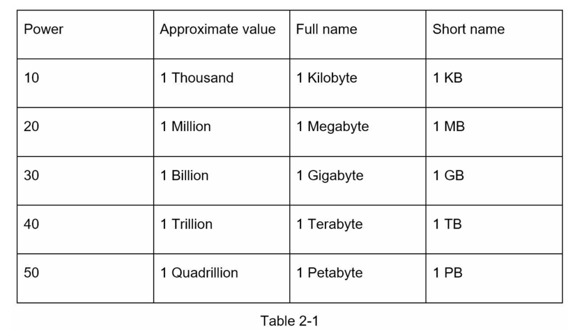
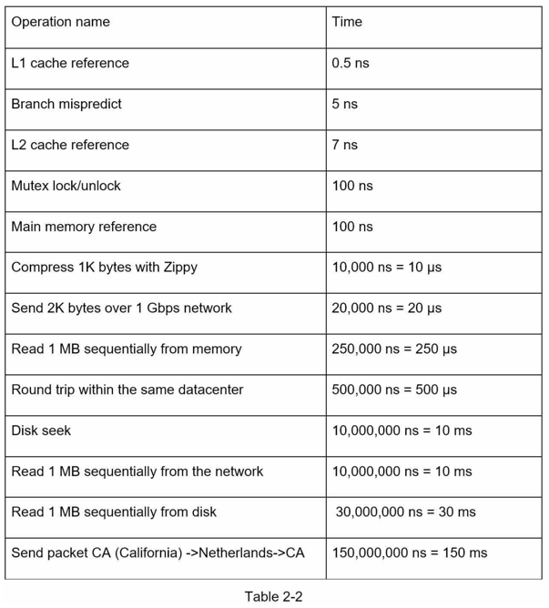
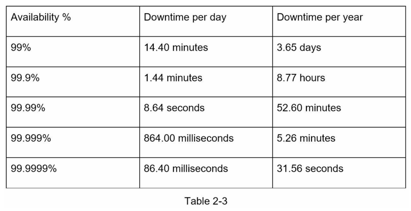

### 2的幂次方

一个字节是8个位的序列。一个 ASCII 字符使用一个字节的内存（8位）。

### 延迟数据

* 内存速度快，但磁盘速度慢。
* 如果可能的话，应避免磁盘寻道。
* 简单的压缩算法速度快。
* 在发送数据到互联网之前，尽可能对数据进行压缩。
* 数据中心通常位于不同的区域，发送数据之间需要一定的时间。

### 可用性数据

高可用性是系统持续运行的能力，期望能够长时间保持操作。 高可用性通常以百分比表示，100%意味着服务没有任何停机时间。大多数服务的可用性介于99%到100%之间。

服务水平协议（SLA）是服务提供商常用的术语。这是你（服务提供商）与你的客户之间的协议，该协议正式定义了你的服务将提供的运行时间水平。 云服务提供商Amazon、Google和Microsoft将它们的SLA设置在99.9%或更高。系统的运行时间传统上以数字的形式进行测量。 数字越多，表示系统的运行时间越长。 如表2-3所示，数字数量与预期系统停机时间相关。 

