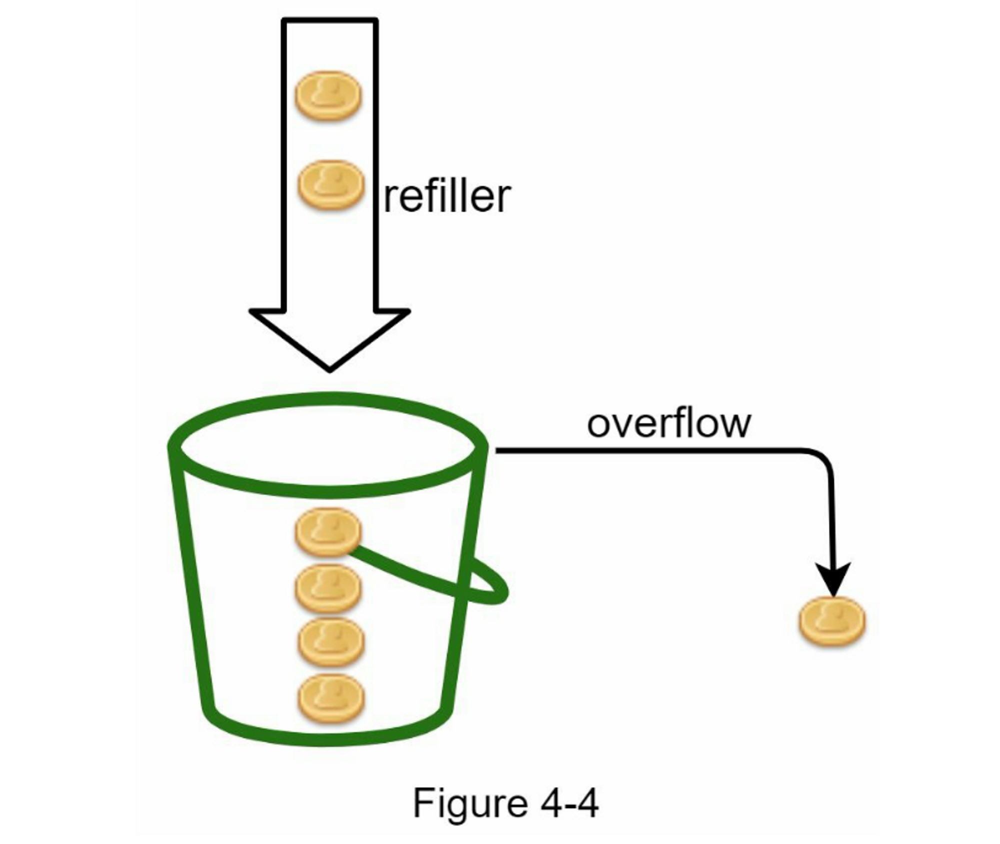
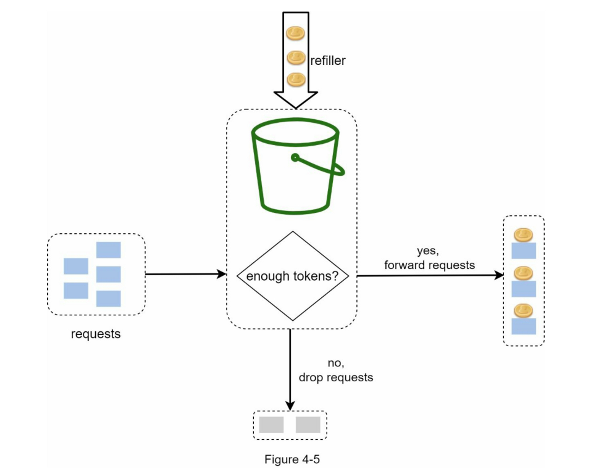
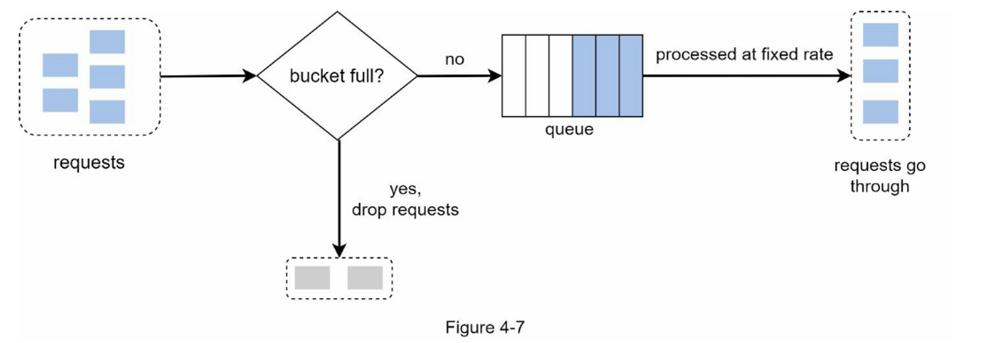
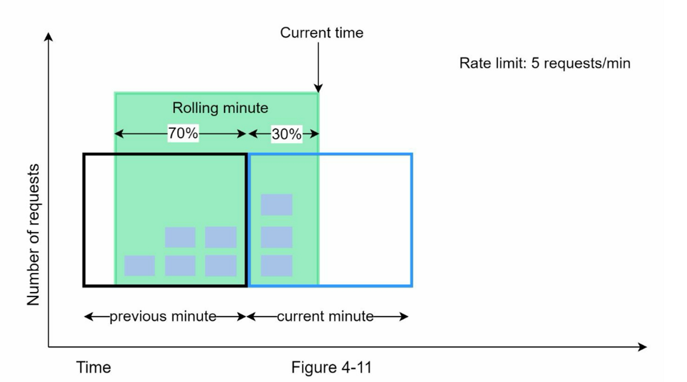
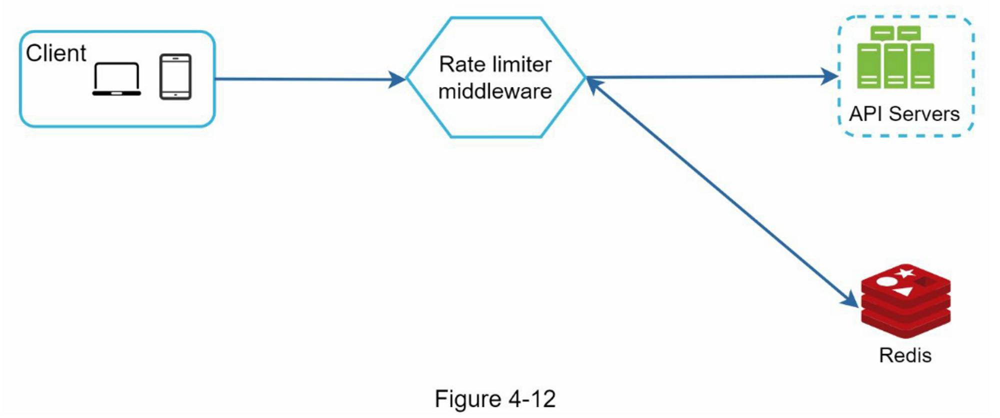
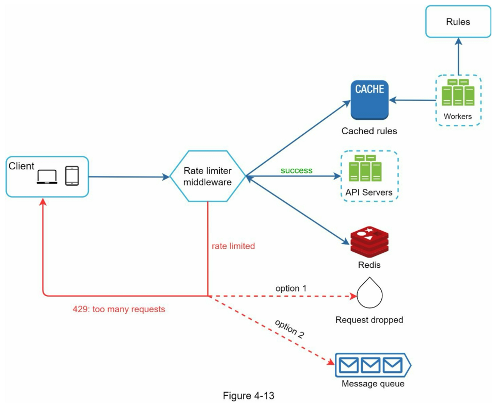
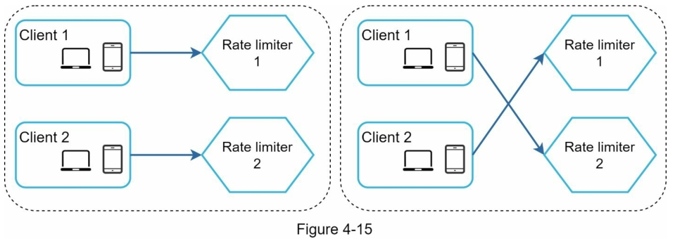
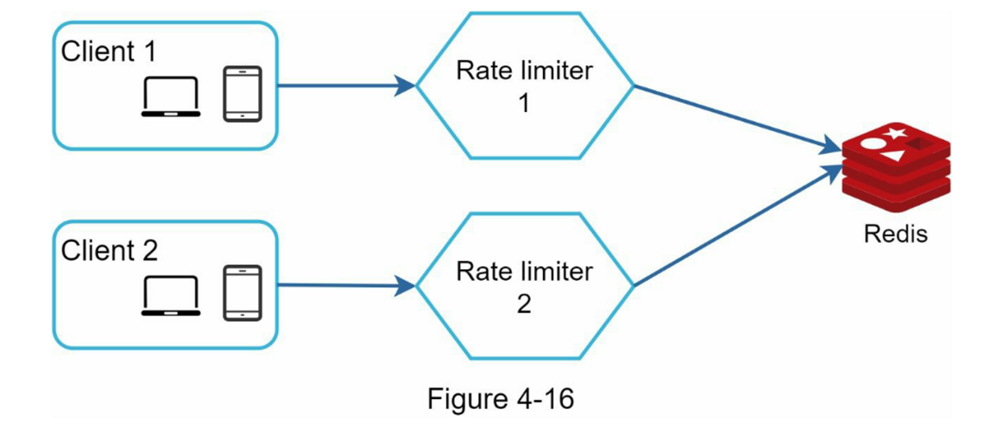

使用 API 限流器的好处：

* 防止拒绝服务 (DoS) 攻击造成的资源匮乏 \[1]。 几乎大型科技公司发布的所有 API 都强制执行某种形式的速率限制。 例如，Twitter将每3小时的推文数量限制为300条\[2]。 Google docs APIs有如下默认限制：每个用户每60秒读取请求为300次\[3]。 限流器通过阻止多余的调用来防止DoS攻击，无论是有意还是无意的。
* 降低成本。限制过多的请求意味着减少服务器数量，将更多资源分配给高优先级的API。 速率限制对于使用付费第三方API的公司来说极为重要。 例如，你对以下外部API的调用是按次数收费的：检查信用、付款、检索健康记录等。限制调用次数对减少成本至关重要。
* 防止服务器过载。为了减少服务器的负荷，使用限流器来过滤由机器人或用户的不当行为造成的过量请求。

### 第1步：了解问题并确定设计范围

**要求**

以下是对系统要求的概述

* 准确地限制过多的请求
* 低延迟：限流器不能降低Http响应时间。
* 尽可能的占用更少的内存。
* 分布式速率限制，要求可以在多个服务器或进程之间共享。
* 异常处理，当用户的请求受到限制时，向用户显示明确的异常信息。
* 高容错性。如果限流器出现任何问题（例如，一个缓存服务器离线），它不会影响整个系统。

### 第2步：提出高层次的设计方案并获得认同

#### 限流器放在哪里

* 评估你目前的技术栈，如编程语言、缓存服务等。确保你目前的编程语言能够有效地在服务器端实现速率限制。
* 确定适合你业务需求的速率限制算法。当你在服务器端实施一切时，你可以完全控制算法。然而，如果你使用第三方网关，你的选择可能是有限的。
* 如果你已经使用了微服务架构，并在设计中包含了一个API网关来执行认证、IP白名单等，你可以在API网关上添加一个限流器。
* 建立你自己的速率限制服务需要时间。如果你没有足够的工程资源来实现限流器，商业API网关是一个更好的选择。

### 限流算法

* 令牌桶（Token bucket）
* 漏桶算法（Leaking bucket）
* 固定窗口计数器（Fixed window counter）
* 滑动窗口日志（Sliding window log）
* 滑动窗口计数器（Sliding window counter）

**令牌桶算法**

令牌桶（Token bucket）算法广泛用于速率限制。 它简单易懂，常被互联网公司采用。 Amazon \[5] 和 Stripe \[6] 都使用这个算法来限制他们的 API 请求。

**令牌桶算法的工作原理如下：**

* 令牌桶是一个具有预定义容量的容器。 令牌会以预定的速率定期放入桶中， 一旦桶满了，就不再添加令牌。 如图4-4所示，令牌桶容量为4，注入装置每秒向桶中放入2个令牌，一旦桶满了，多余的令牌就会溢出。 

每个请求都会消耗一个令牌。当一个请求到达时，我们检查桶中是否有足够的令牌。图4-5解释了它是如何工作的。

* 如果有足够的令牌，我们会为每个请求取出一个令牌，然后请求通过。
* 如果没有足够的令牌，则该请求被丢弃。

**优点**

* 算法容易实现
* 占用内存少
* 令牌桶允许在短时间内进行突发流量。只要有剩余的令牌，请求就可以通过。

**缺点**

* 算法中有两个参数，即桶的大小和令牌的补充速率。然而，正确调整它们可能具有挑战性。

**漏桶算法**

漏桶（Leaking bucket）算法与令牌桶类似，不同之处在于请求是以固定速率处理的。它通常用先入先出（FIFO）队列来实现。

该算法的工作原理如下：

* 当请求到达时，系统会检查队列是否已满。如果队列未满，则将请求添加到队列中。
* 否则，将丢弃该请求。
* 请求会在固定的时间间隔内从队列中取出并进行处理。

漏桶算法需要以下两个参数

* 桶的大小：它等于队列的大小。队列容纳了要以固定速度处理的请求。
* 流出率：定义了在固定速率下可以处理多少请求，通常以秒为单位。

**优点：**

* 鉴于队列大小有限，内存效率高。
* 请求以固定的速率处理，因此它适用于需要稳定流出速率的用例。

**缺点：**

* 突发的流量使队列中充满了旧的请求，如果这些请求没有得到及时处理，最近的请求将受到速率限制。
* 算法中有两个参数，要适当地调整它们可能并不容易。

**固定窗口计数器算法**

固定窗口计数器（Fixed window counter）算法工作原理如下：

* 该算法将时间轴划分为固定大小的时间窗口，并为每个窗口分配一个计数器。
* 每个请求将计数器增加一。
* 一旦计数器达到预定的阈值，新的请求就会被放弃，直到新的时间窗口开始。

**优点：**

* 内存高效
* 容易理解
* 在单位时间窗口结束时重新设置可用配额，适合某些使用情况

**缺点：**

* 窗口边缘的流量激增可能导致超过允许配额的请求被通过（有突刺）

**滑动窗口日志算法**

如前所述，固定窗口计数（Sliding window log）算法有一个主要问题：它允许更多的请求在窗口的边缘通过。滑动窗口日志算法解决了这个问题。 它的工作原理如下：

* 该算法对请求的时间戳进行跟踪。时间戳数据通常保存在缓存中，如Redis的sorted\[8] 。
* 当一个新的请求进来时，删除所有过期的时间戳。过时的时间戳被定义为比当前时间窗口的开始时间更早的时间戳。
* 将新请求的时间戳添加到日志中
* 如果日志大小与允许的计数相同或更低，则接受请求。否则，它将被拒绝

**优点：**

* 这种算法实现的速率**限制是非常准确**的。在任何滚动窗口中，请求都不会超过速率限制。

**缺点：**

* 该算法消耗了大量的内存，因为即使一个请求被拒绝，其时间戳仍可能被存储在内存中

**滑动窗口计数器算法**

滑动窗口计数器(Sliding window counter)算法是一种混合方法，结合了固定窗口计数器和滑动窗口日志。

**优点：**

* 它平滑了流量的峰值，因为速率是基于前一个窗口的平均速率。
* 内存高效

**缺点：**

* 它只适用于不太严格的回看窗口。它是实际速率的近似值，因为它假设前一个窗口的请求是均匀分布的。然而，这个问题可能并不像它看起来那么糟糕。 根据Cloudflare\[10]所做的实验，在4亿个请求中，只有0.003%的请求被错误地允许或限制速率

#### 高层次的架构

限流算法的基本思想很简单。在高层次上，我们需要一个计数器来跟踪来自同一用户、IP地址等的多少个请求。如果计数器大于限制值，则请求被禁止。

我们应该在哪里存储计数器？由于磁盘访问速度慢，使用数据库并不是一个好主意。选择内存缓存是因为它速度快并且支持基于时间的过期策略。 例如，Redis\[11]是实现速率限制的一个流行选择。它是一个内存中的存储，提供两个命令：`INCR`和`EXPIRE`

* `INCR`：它使存储的计数器加1。
* `EXPIRE`：它为计数器设置一个超时。如果超时过后，计数器会被自动删除。

* 客户端向限流中间件发送请求
* 限流中间件从Redis中相应的桶中获取计数器，并检查是否达到限制
  * 如果达到限制，则拒绝该请求
  * 如果没有达到限制，请求会被发送到API服务器。同时，系统会增加计数器并将其保存回Redis。

### 第3步：深入设计

* 如何创建速率限制规则？这些规则储存在哪里？
* 如何处理受限的请求？

#### 超过速率限制

如果一个请求被限制了速率，API会向客户端返回一个HTTP响应代码429（请求太多）。根据不同的使用情况，我们可能会将速率受限的请求排队等候以后处理。 例如，如果一些订单由于系统过载而受到速率限制，我们可以保留这些订单以便以后处理。

#### 限流器请求头

一个客户如何知道它是否被节流？客户端如何知道在被节流之前允许的剩余请求的数量？答案就在HTTP响应头中。限流器向客户端返回以下 HTTP 标头：

* X-Ratelimit-Remaining：窗口内允许请求的剩余数量
* X-Ratelimit-limit：它表示客户端在每个时间窗口可以进行多少次调用
* X-Ratelimit-Retry-After：等待的秒数，直到你可以再次提出请求而不被节流。

当用户发送过多请求时，将向客户端返回 429 too many requests 错误和 X-Ratelimit-Retry-After 标头。

#### 详细设计

* 规则被存储在磁盘上。工作者经常从磁盘中提取规则，并将其存储在高速缓存中。
* 当客户端向服务器发送请求时，该请求首先被发送到限流中间件。
* 限流中间件从缓存中加载规则。它从Redis缓存中获取计数器和最后一次请求的时间戳。根据响应，限流器决定：
  * 如果请求没有速率限制，它将被转发到API服务器。
  * 如果请求受到速率限制，限流器会向客户端返回 429 too many requests 错误。 同时，请求被丢弃或转发到队列。

#### 分布式环境下的限流器

构建一个在单个服务器环境下运行的限流器并不困难。然而，将系统扩展到支持多个服务器和并发线程是另一回事。这里有两个挑战：

* 竞争条件
* 同步问题

**竞争条件**

如前所述，限流器在高层的工作原理如下

- 从Redis读取计数器的值
- 检查 ( 计数器 + 1 ) 是否超过阈值
- 如果不是，则将 Redis 中的计数器值加 1

**同步问题**

同步是分布式环境中要考虑的另一个重要因素。 要支持数百万用户，一个限流器服务器可能不足以处理流量。 当使用多个限流器服务器时，需要同步。 例如，在图 4-15 的左侧，客户端 1 将请求发送到限流器 1，客户端 2 将请求发送到限流器 2。 由于 Web 层是无状态的，客户端可以将请求发送到不同的限流器，如图所示，在图 4-15 的右侧。 如果没有发生同步，限流器 1 不包含有关客户端 2 的任何数据。因此，限流器无法正常工作。 

更好的方法是使用像 Redis 这样的集中式数据存储。

#### 性能优化

#### 监控

限流器到位后，最重要的是要收集分析数据以检查限流器是否有效。

首先，我们要确保：

* 限流算法是有效的
* 限流规则是有效的

### 第4步：总结

可以提及其他谈话要点:

* 硬件 与 软件限流对比
  * 硬件：请求的数量不能超过阈值
  * 软件：请求可以在短时间内超过阈值
* 不同级别的限流。在本章中，我们只讨论了应用程序级别（HTTP：第 7 层）的限流，可以在其他层应用限流。例如，你可以使用Iptables\[15]（IP：第3层）按IP地址应用速率限制。 注意：开放系统互连模型（OSI模型）有7层\[16]。第1层：物理层，第2层：数据链路层，第3层：网络层，第4层：传输层，第5层：会话层，第6层：表示层，第7层：应用层。
* 避免被限速，使用最佳实践设计你的客户端：
  * 使用客户端缓存，以避免频繁调用API
  * 了解限制，不要在短时间内发送太多请求
  * 包含捕获异常或错误的代码，以便客户端可以从异常中恢复正常
  * 为重试逻辑增加足够的回退时间