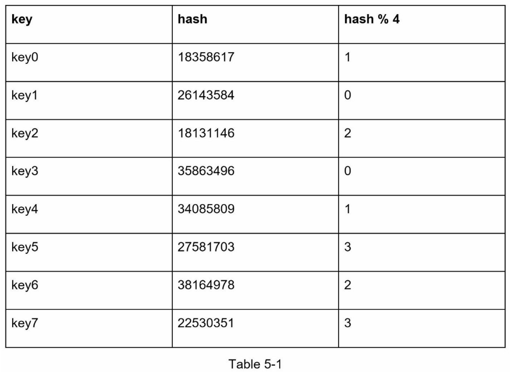
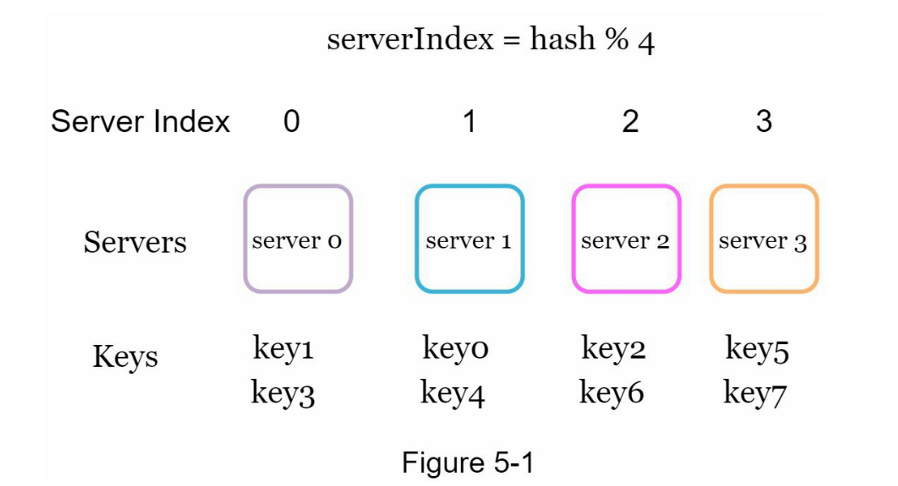
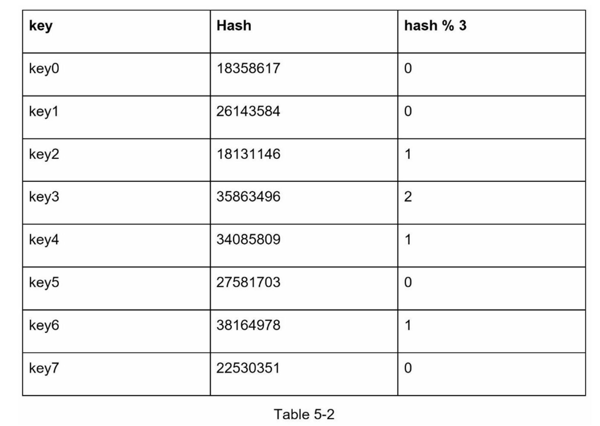

# 第05章：一致性hash设计

#### 再哈希问题

如果你有n个缓存服务器，平衡负载的一个常用方法是使用以下哈希方法：

$$serverIndex = hash(key) \bmod N$$，其中N是服务器池的大小

当服务器池的大小是固定的，而且数据分布均匀时，这种方法效果很好。然而，当增加新的服务器，或删除现有的服务器时，问题就会出现。

例如，如果服务器1下线了，服务器池的大小就变成了 3。使用相同的哈希函数，我们得到的键的哈希值是相同的。 但是应用求余操作，我们会得到不同的服务器索引，因为服务器的数量减少了 1。 通过应用 $$hash \bmod 3$$，我们得到的结果如表5-2所示：

如图5-2所示，大多数键都被重新分配，而不仅仅是最初存储在脱机服务器（服务器1）中的键。 这意味着，当服务器1离线时，大多数缓存客户会连接到错误的服务器来获取数据，这就造成了高速缓存失误的风暴。一致性哈希是一种有效的技术来缓解这个问题。

#### 一致性哈希

引用自维基百科：“一致性哈希是一种特殊的哈希，当重新调整哈希表的大小并使用一致性哈希时，平均只需要重新映射 $$k/n$$ 个键，其中 $$k$$ 是键的数量， $$n$$ 是槽的数量。 相比之下，在大多数传统的哈希表中，数组槽数量的变化导致几乎所有键都被重新映射 \[1]”

#### 基本方法中的两个问题

一致哈希算法是由麻省理工学院的Karger等人提出的\[1]。

基本步骤如下：

1. 使用均匀分布的哈希函数将服务器和键映射到环上。
2. 要想知道一个键被映射到哪个服务器，从键的位置顺时针查找，直到找到环上的第一个服务器。

这种方法存在两个问题：

1. 首先，考虑到可以添加或删除服务器，**不可能保持环上所有服务器的分区大小相同**。 分区是相邻服务器之间的哈希空间。 分配给每个服务器的环上分区的大小可能非常小或相当大。在图5-10中，如果删除s1，s2的分区（用双向箭头突出显示）是s0和s3分区的两倍。

   

2. 第二，在环上有可能出现**不均匀的键分布**。例如，如果服务器被映射到图5-11中所列的位置，大部分的密钥都存储在`serve2`上。然而，`server1`和`serser3`没有数据。

#### 虚拟节点

虚拟节点是指真实节点，每个服务器由环上的多个虚拟节点表示。在图5-12中，server0和server1都有3个虚拟节点。 3是任意选择的；而在现实世界的系统中，虚拟节点的数量要大得多。我们不用s0，而是用s0\_0、s0\_1和s0\_2来代表环上的server0。 同样地，s1\_0、s1\_1和s1\_2代表环上的server1。通过虚拟节点，每个服务器负责多个分区。标签为s0的分区（边）由server0管理。 另一方面，标签为s1的分区则由server1管理。

