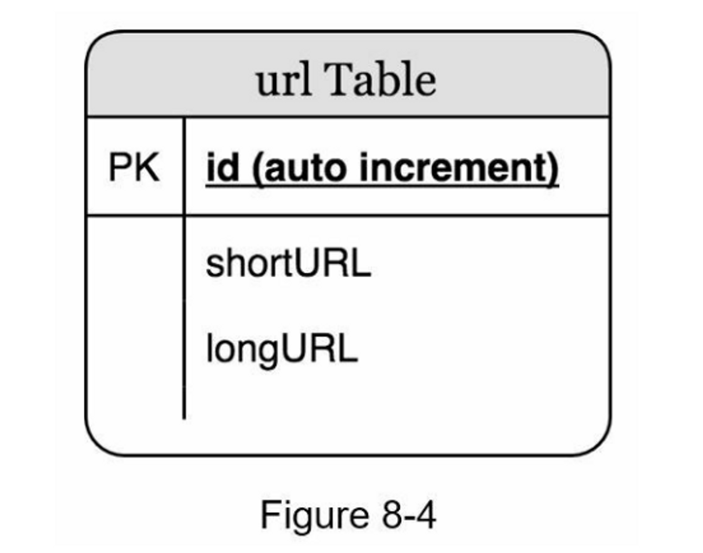
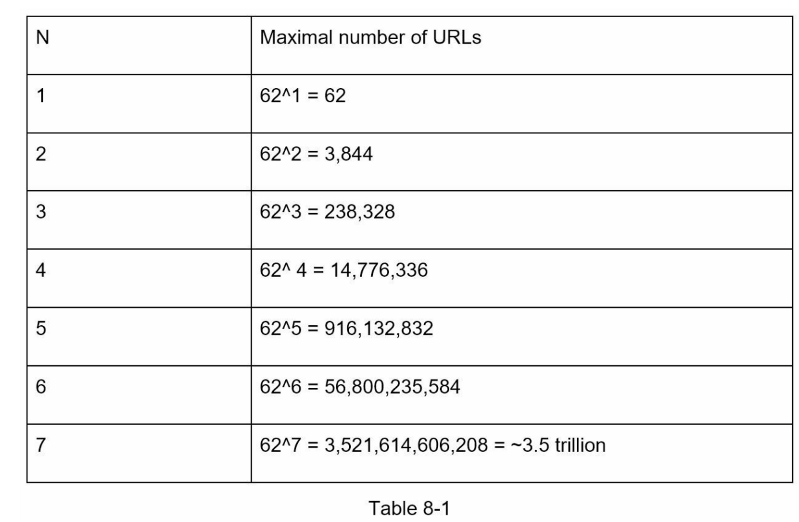
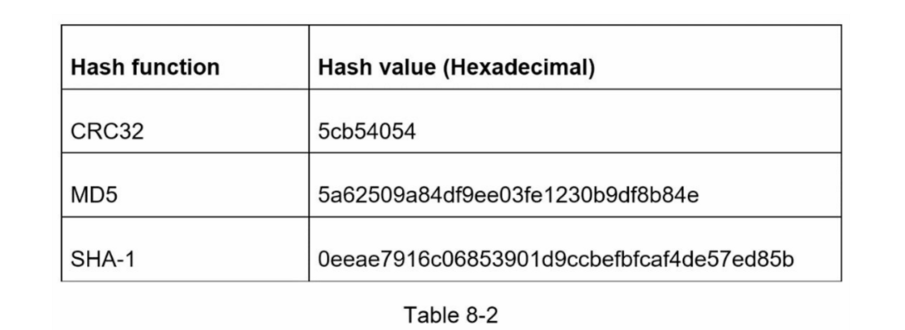
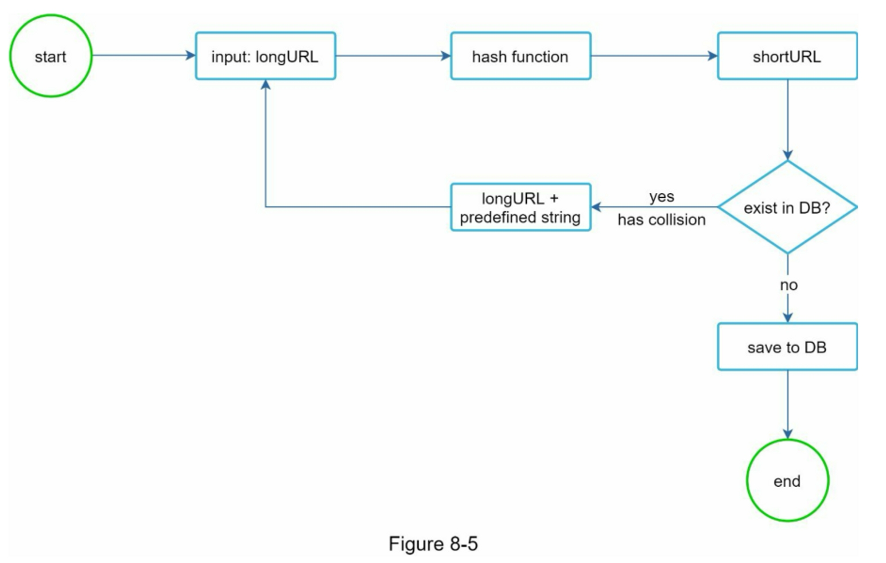
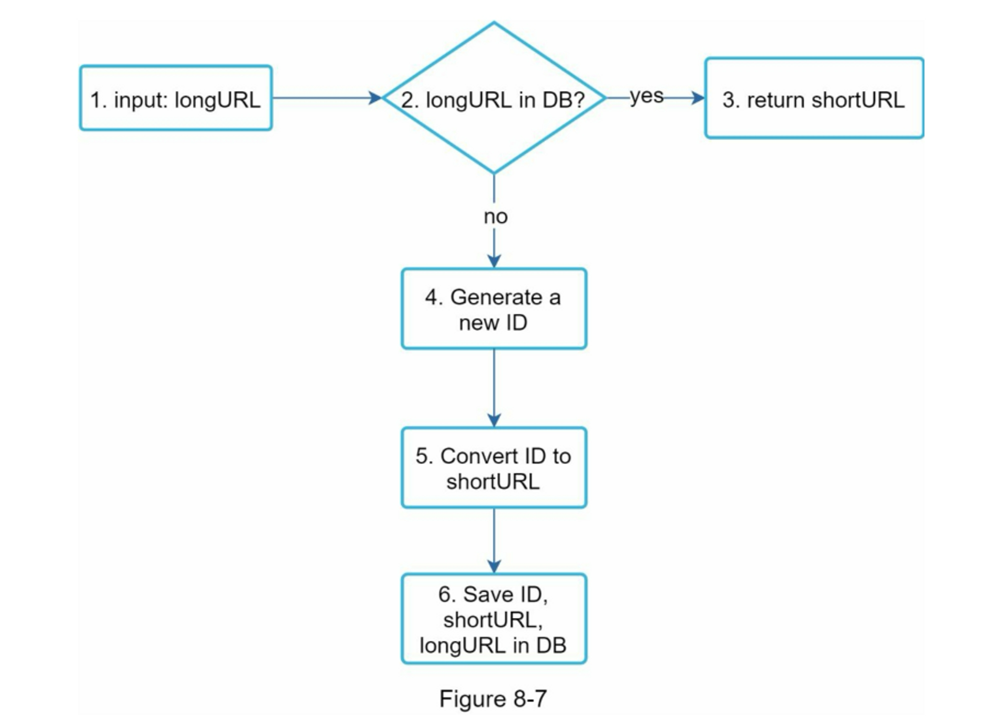
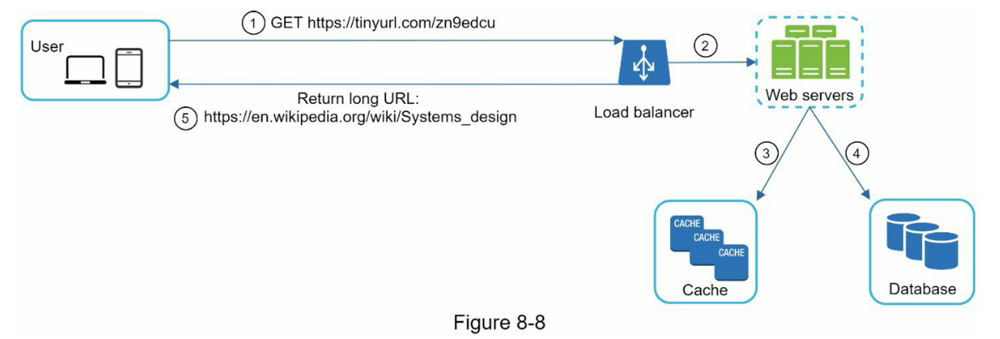

第08章：短网址设计

### 第1步：了解问题并确定设计范围

以下是基本用例：

1. URL缩短：给定一个长的URL => 返回一个短得多的URL
2. URL重定向：给定一个短的URL => 重定向到原来的URL
3. 高可用性、可扩展性和容错考虑

#### 粗略估计系统量级

* 写操作：每天产生1亿个URL。
* 每秒写操作：亿/24/3600 = 1160
* 读操作：假设读操作和写操作的比例为10:1，读每秒操作：1160 \* 10 = 11,600
* 假设 URL 缩短服务将运行 10 年，这意味着我们必须支持 1 亿 \* 365 \* 10 = 3650 亿条记录。
* 假设平均 URL 长度为 100。
* 10 年的存储需求：3650 亿 \* 100 字节 \* 10 年 = 365 TB

### 第2步：提出高层次的设计方案并获得认同

在本节中，我们将讨论 API 端点、URL 重定向和 URL 缩短。

#### API 端点

API端点促进了客户和服务器之间的通信。我们将设计REST风格的API。如果你不熟悉restful API，你可以查阅外部资料，比如参考资料中的资料\[1]。一个URL缩短器主要需要两个API端点。

1. 网址缩短。 要创建一个新的短 URL，客户端发送一个 POST 请求，其中包含一个参数：原始长 URL。 API 如下所示：

   **POST api/v1/data/shorten**

   * 请求参数：{longUrl: longURLString}。
   * 返回 shortURL

2. URL重定向。为了将一个短的URL重定向到相应的长的URL，一个客户端发送一个GET请求。该API看起来像这样：

   **GET api/v1/shortUrl**

   * 返回用于HTTP重定向的 longURL

#### URL 重定向

图8-1显示了当你在浏览器上输入一个tinyurl时会发生什么。一旦服务器收到tinyurl请求，它就会用301重定向将短网址改为长网址。

值得在这里讨论的一件事是 301 重定向与 302 重定向。

* **301重定向**。301重定向表明，请求的URL被 "永久 "地移到了长URL上。由于是永久重定向，浏览器会缓存响应，对同一URL的后续请求将不会被发送到URL缩短服务上。相反，请求将直接被重定向到长网址服务器。
* **302重定向**。302重定向意味着URL被 "暂时 "移到长URL上，这意味着对同一URL的后续请求将首先被发送到URL缩短服务上。然后，它们会被重定向到长网址服务器。

每种重定向方法都有其优点和缺点。如果优先考虑**减少服务器负载**，使用301重定向是有意义的，因为只有同一URL的第一个请求被发送到URL缩短服务器。然而，如果分析是重要的，302重定向是一个更好的选择，因为它可以更容易地**跟踪点击率和点击的来源。**

实现URL重定向的最直观的方法是**使用哈希表**。假设哈希表存储\<shortURL, longURL>对，URL重定向可以通过以下方式实现。

* 获取longURL: `longURL = hashTable.get(shortURL)`
* 一旦你得到longURL，就执行URL重定向。

#### 缩短网址

让我们假设短的URL看起来像这样：`www.tinyurl.com/{hashValue}`。为了支持缩短URL的用例，我们必须找到一个哈希函数fx，将长URL映射到hashValue，

哈希函数必须满足以下要求。

* 每个longURL必须被散列成一个hashValue。
* 每个hashValue都可以被映射回longURL

### 第3步：深入设计

#### 数据模型

在高层设计中，所有的东西都存储在一个哈希表中。这是一个很好的起点；然而，这种方法在现实世界的系统中是不可行的，因为内存资源是有限的和昂贵的。一个更好的选择是将\<shortURL, longURL>映射存储在一个关系数据库中。

#### 哈希函数

哈希函数用于将一个长的URL哈希成一个短的URL，也称为 hashValue。

**哈希值的长度**

hashValue 由\[0-9, a-z, A-Z]中的字符组成，包含 $$10+26+26=62$$ 个可能的字符。要计算 hashValue 的长度，请找出最小的 n，使 $$62^n \ge 365亿$$。根据估计，系统必须支持多达 3650 亿个 URL。 表 8-1 显示了 hashValue 的长度和它可以支持的相应的最大 URL 数。

为了缩短长的URL，我们应该实现一个散列函数，将长的URL散列成一个7个字符的字符串。一个直接的解决方案是使用知名的哈希函数，如CRC32、MD5或SHA-1。

第一种方法是收集哈希值的前7个字符；然而，这种方法会导致哈希碰撞。为了解决哈希碰撞，我们可以递归地追加一个新的预定义字符串，直到不再发现碰撞。

这种方法可以消除碰撞；但是，查询数据库以检查每个请求是否存在短网址的成本很高。一种叫做**Bloom过滤器**的技术\[2]可以提高性能。布隆过滤器是一种空间效率高的概率技术，用来测试一个元素是否是一个集合的成员。更多细节请参考参考资料\[2]。

**两种方法的比较**

下表显示了两种方法的差异。

| 哈希+碰撞解决                                      | base 62 转换                                                 |
| -------------------------------------------------- | ------------------------------------------------------------ |
| 固定短URL长度                                      | 短URL长度不固定，它随着 id 变化                              |
| 不需要唯一ID生成器                                 | 该选项依赖于唯一ID生成器                                     |
| 可能出现冲突，必须解决                             | 碰撞是不可能的，因为 ID 是唯一的                             |
| 不可能计算出下一个可用的短网址，因为它不依赖于ID。 | 如果新条目的 ID 递增 1，则很容易找出下一个可用的短 URL。 这可能是一个安全问题。 |

#### URL 缩短的深入研究

作为系统的核心部分之一，我们希望URL缩短的流程在逻辑上是简单和实用的。在我们的设计中使用了62进制转换。我们建立了以下图表（图8-7）来演示这个流程。

1. longURL 是输入的
2. 系统检查 longURL 是否存在于数据库中
3. 如果是的话，这意味着longURL之前被转换为shortURL。在这种情况下，从数据库中获取shortURL并将其返回给客户端。
4. 如果不是，longURL是新的。一个新的唯一ID（主键）由唯一ID生成器生成。
5. 使用base 62转换将ID转换为shortURL。
6. 用ID、shortURL和longURL创建一个新的数据库记录。

#### URL重定向的深入研究

图 8-8 显示了 URL 重定向的详细设计。 由于读取多于写入，`<shortURL, longURL>` 映射存储在缓存中以提高性能。

URL重定向的流程总结如下：

* 一个用户点击了一个短的URL链接：`https://tinyurl.com/zn9edcu`
* 负载均衡器将请求转发给网络服务器
* 如果shortURL已经在缓存中，直接返回longURL。
* 如果短URL不在缓存中，从数据库中获取长URL。如果它不在数据库中，很可能是用户输入了一个无效的短网址。
* longURL被返回给用户。