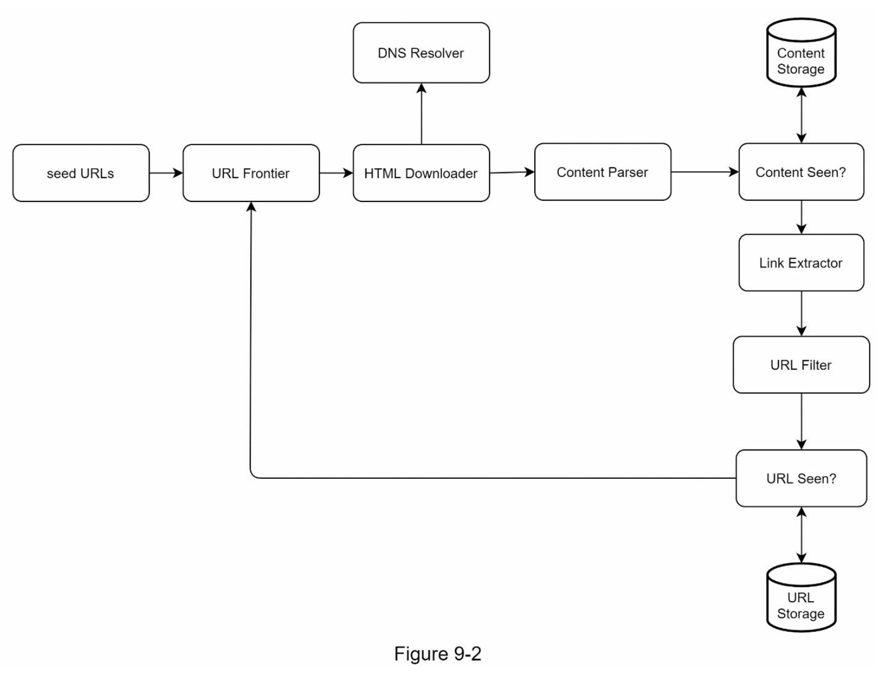
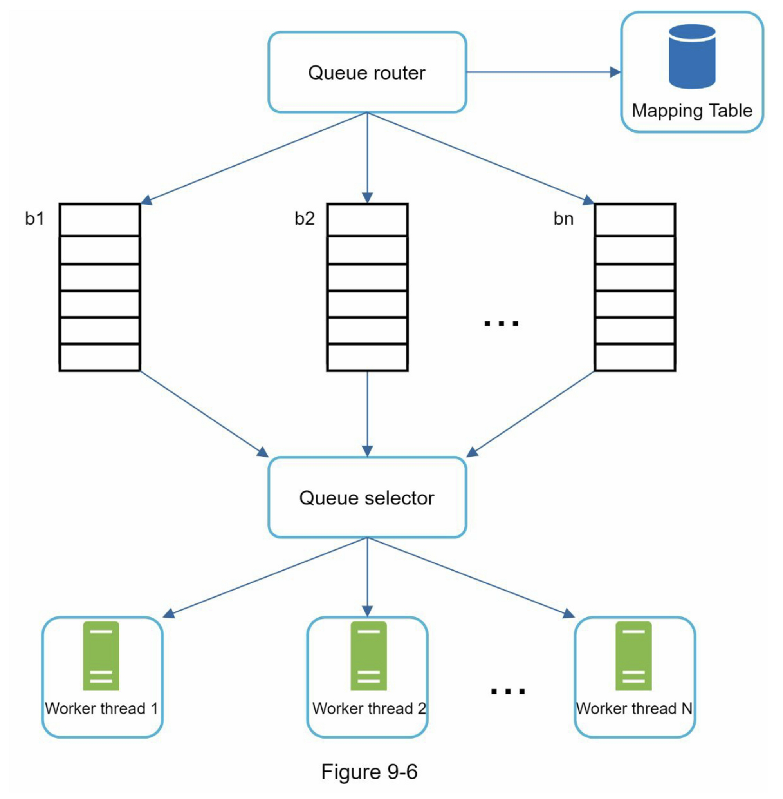

### 第1步：了解问题并确定设计范围

网络爬虫的基本算法很简单：

* 给定一组URLs，下载所有由URLs指向的网页。
* 从这些网页中提取 URL。
* 将新的 URL 添加到要下载的 URL 列表中。重复这3个步骤。
* 记下优秀网络爬虫的以下特征也很重要：

  * 可伸缩性（Scalability）：网络非常大。那里有数十亿个网页。使用并行化网络爬行应该非常有效。
  * 鲁棒性（Robustness）：网络充满了陷阱。错误的 HTML、无响应的服务器、崩溃、恶意链接等都很常见。爬虫必须处理所有这些边缘情况。
  * 礼貌（Politeness）：爬虫不应该在短时间间隔内向网站发出太多请求。
  * 可扩展性（Extensibility）：系统非常灵活，因此只需进行最少的更改即可支持新的内容类型。比如我们以后要抓取图片文件，应该不需要重新设计整个系统。

### 第2步：提出高层次的设计方案并获得认同

一旦需求明确了，我们就开始进行高层设计。

#### Seed URLs

网络爬虫使用种子 URL 作为爬网过程的起点。例如，要抓取大学网站的所有网页，选择种子 URL 的一种直观方法是使用大学的域名。

#### URL Frontier

大多数现代网络爬虫将爬行状态分为两种：待下载和已下载。存储待下载的URL的组件被称为URL Frontier。你可以把它称为先进先出（FIFO）队列。关于URL Frontier的详细信息，请参考深入研究的内容。

#### HTML Downloader

HTML Downloader 从互联网上下载网页。这些URL是由URL Frontier提供的。

#### DNS Resolver

要下载网页，必须将 URL 转换为 IP 地址。 HTML Downloader 调用 DNS Resolver 为 URL 获取相应的 IP 地址。例如，截至 2019 年 3 月 5 日，URL [www.wikipedia.org](http://www.wikipedia.org/) 已转换为 IP 地址 198.35.26.96。

#### Content Parser

下载网页后，必须对其进行解析和验证，因为格式错误的网页可能会引发问题并浪费存储空间。在爬网服务器中实现内容解析器会减慢爬网过程。因此，Content Parser（内容解析器）是一个单独的组件。

#### Content Seen?

在线研究\[6]显示，29%的网页是重复的内容，这可能导致同一内容被多次存储。我们引入了 "Content Seen? "数据结构，以消除数据的冗余，缩短处理时间。它有助于检测以前存储在系统中的新内容。为了比较两个HTML文档，我们可以逐个字符进行比较。然而，这种方法既慢又费时，特别是当涉及到数十亿的网页时。完成这项任务的一个有效方法是比较两个网页的哈希值\[7]。

#### Content Storage

它是一个用于存储HTML内容的存储系统。存储系统的选择取决于诸如数据类型、数据大小、访问频率、寿命等因素，磁盘和内存都被使用。

* 大部分内容存储在磁盘上，因为数据集太大而无法放入内存。
* 热门内容保存在内存中以减少延迟。

#### URL Extractor

URL Extractor（网址提取器） 从 HTML 页面解析和提取链接。图 9-3 显示了链接提取过程的示例。通过添加“[https://en.wikipedia.org](https://en.wikipedia.org/)”前缀将相对路径转换为绝对 URL。

#### URL Filter

URL Filter 排除某些内容类型、文件扩展名、错误链接和“黑名单”站点中的 URL。

#### URL Seen？

"URL Seen? "是一个数据结构，用于跟踪之前被访问过的或已经在Frontier中的URL。"URL Seen? "有助于避免多次添加相同的URL，因为这可能会增加服务器负载并导致潜在的无限循环。

布隆过滤器和哈希表是实现 "URL Seen? "组件的常用技术。我们不会在这里介绍布隆过滤器和哈希表的详细实现。欲了解更多信息，请参考参考资料\[4]\[8]。

#### URL Storage

URL Storage 存储已经访问过的 URL。到目前为止，我们已经讨论了每个系统组件。接下来，我们将它们放在一起来解释工作流程。

#### DFS vs BFS

你可以把网络想象成一个有向图，其中网页作为节点，超链接（URL）作为边。抓取过程可以被视为从一个网页到其他网页的有向图的遍历。两种常见的图形遍历算法是DFS和BFS。然而，DFS通常不是一个好的选择，因为DFS的深度可能很深。

BFS 通常被网络爬虫使用，并通过先进先出 (FIFO) 队列实现。在 FIFO 队列中，URL 按照它们入队的顺序出队。但是，这种实现有两个问题：

1. 来自同一网页的大多数链接都链接回同一主机。在图 9-5 中，[wikipedia.com](http://wikipedia.com/) 中的所有链接都是内部链接，使得爬虫忙于处理来自同一主机（[wikipedia.com](http://wikipedia.com/)）的 URL。当爬虫试图并行下载网页时，维基百科服务器将被请求淹没。这被认为是“不礼貌的”

   

2. 标准的BFS没有考虑到一个URL的优先级。网络很大，不是每个页面都有相同的质量和重要性。因此，我们可能希望根据页面排名、网络流量、更新频率等来确定URL的优先级。

#### URL Frontier

URL Frontier 有助于解决这些问题。 URL Frontier 是一种存储要下载的 URL 的数据结构。 URL Frontier 是确保礼貌、URL 优先级和新鲜度的重要组成部分。参考资料 \[5] \[9] 中提到了一些关于 URL Frontier 的值得注意的论文。这些论文的研究结果如下：

* 礼貌性

  一般来说，网络爬虫应该避免在短时间内向同一个托管服务器发送过多的请求。发送过多请求会被视为“不礼貌”，甚至被视为拒绝服务 (DOS) 攻击。例如，在没有任何限制的情况下，爬虫可以每秒向同一个网站发送数千个请求。这会使 Web 服务器不堪重负。

  强制礼貌的一般想法是一次从同一主机下载一个页面。可以在两个下载任务之间添加延迟。礼貌约束是通过维护从网站主机名到下载（工作）线程的映射来实现的。每个下载线程都有一个单独的 FIFO 队列，并且只下载从该队列中获得的 URL。图 9-6 显示了管理礼貌的设计。

* Queue router：它确保每个队列（b1，b2，... bn）仅包含来自同一主机的 URL。
* Mapping table:：它将每个主机映射到一个队列

* FIFO 队列 b1、b2 到 bn：每个队列包含来自同一主机的 URL。
* Queue selector：每个工作线程都映射到一个 FIFO 队列，它只从该队列下载 URL。队列选择逻辑由Queue selector完成
* Worker thread 1 t到 N：一个工作线程从同一台主机上一个接一个地下载网页，可以在两个下载任务之间添加延迟。

#### HTML 下载器

HTML下载器使用HTTP协议从互联网上下载网页。在讨论HTML下载器之前，我们先看一下Robots排除协议。

**Robots.txt**

Robots.txt，称为Robots排除协议，是网站用来与爬虫沟通的标准。它规定了爬虫可以下载哪些页面。在尝试爬行一个网站之前，爬虫应首先检查其相应的robots.txt，并遵守其规则。